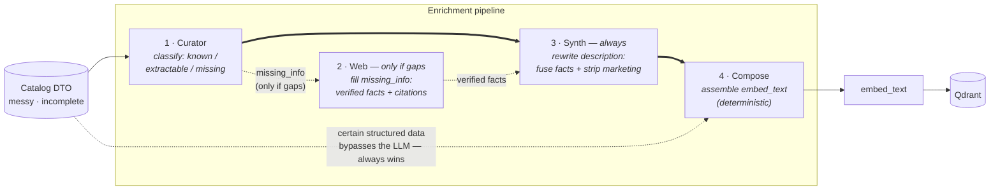
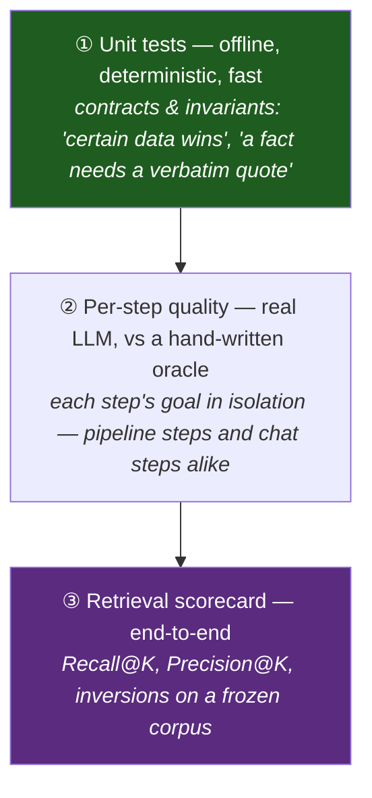

# Seller 🎲 — a RAG advisor that *sells* board games

[](https://github.com/msporchia/board-game-rag-seller/actions/workflows/ci.yml)

> **🔬 Personal research project.** A solo build to explore one idea properly — how to make
> semantic search over a messy product catalog actually *good* — and to practice
> production-shaped RAG (LangChain · Qdrant · FastAPI · Ollama). Local-first, offline-runnable,
> provider-swappable. Not a product; a place to do the engineering well.

A conversational "salesperson" for a board-game shop: instead of a keyword search, it
**understands vague requests** (*"something cooperative and medieval for two"*), filters on
concrete criteria (players, duration, complexity), and recommends **only real, in-stock games**
— never a hallucinated title.

The repo is two stories. **Part 1 — the retrieval engine**: done, measured, and the heart of
the project. **Part 2 — the conversational seller** on top of it: working end-to-end, being
finalized, measured the same way. Results first; how we got there comes after.

---

## The results, on real games 🔍

Three real catalog games, carried end-to-end through the enrichment pipeline and ranked by the
**real retriever** on a frozen 50-game corpus. Same embedding model, same queries — only the
embedded text changes:

| | Game | Before | After |
|---|------|--------|-------|
| 🚀 | [**Terraforming Mars**](docs/showcase/terraforming-mars.md) — thin entry, no description | rank **#45 / #47 / #47** of 50 | rank **#1 / #26 / #1** |
| 🔬 | [**Onitama**](docs/showcase/onitama.md) — rich prose, all atmosphere | genre invisible to search | genre recovered — **every fact carries a verbatim citation** |
| ⚖️ | [**Viticulture**](docs/showcase/viticulture.md) — already well-described | rank **#4** | rank **#23** — *worse*: an honest regression, kept visible |

What happens to each game, in plain words (every step linked if you want the mechanics):

- **Terraforming Mars** arrives with *no description* — to the embedder it's a spec sheet, and
  the query *"gioco di fantascienza per terraformare marte"* ranks it **#45**. The
  [Curator](docs/enrichment/01-curator.md) flags what's missing; the
  [Web step](docs/enrichment/02-web.md) recovers the missing facts from trusted reviews
  (*marte, ossigeno, oceani* — each backed by a quoted source); the
  [Synth step](docs/enrichment/03-synth.md) weaves them into clean prose. Same game, same
  embedder, same query: **#1**.
- **Onitama** has plenty of prose, but it's marketing (*"la magia… un viaggio nel cuore delle
  arti marziali"*) and never says *what kind of game it is*. The Web step fills exactly that
  gap — and keeps **only facts whose quote is literally present in the source page**; a model
  guess with no quote is thrown away, not embedded. The embedded text finally says it plainly:
  an abstract duel for two, decided by cards that pass to your opponent.
- **Viticulture** was already rich — and the pipeline made it **worse**. Synth compressed
  ~2300 chars to ~1200 and dropped *vino / toscana* signal, so a common query slipped off the
  first screen (#4 → #23). We kept the failure: it's written down in
  [`e2e-findings.md`](docs/enrichment/e2e-findings.md) and pinned by an `xfail` test that turns
  green only when it's fixed. A showcase that only shows wins is a sales brochure.

Each walkthrough shows the exact DTO in, the real computed baseline `embed_text`, the
verbatim-cited facts the pipeline adds, and the measured rank delta.
→ [Start here](docs/showcase/README.md).

---

# Part 1 — the retrieval engine

## The principle this project is built on

A real catalog is **heterogeneous and incomplete**: records arrive from different sources with
wildly different quality — some games richly described, many just a name and a few fields. Fed
raw to an embedder, that difference silently *becomes* the ranking: well-documented games
surface, thin ones disappear. Terraforming Mars at **#45** wasn't less relevant — it just had a
thinner record. That's not a ranking; it's a data-entry accident.

> **Every game must be equally findable and equally sellable, whatever the quality of its
> source data.** The system must never penalize a game for where its record came from. If one
> game is to outrank another, it must be **intentional** — margin, recent sales, a promotion —
> applied as an explicit layer, never inherited from data quality.

The lever that makes the principle enforceable:

> **Retrieval quality is decided by the text you embed — not only by the embedding model.**

An embedding is a *lossy semantic centroid* of its input (see [`docs/valutazione.md`](docs/valutazione.md)).
Feed it three paragraphs of marketing (*"epic legendary adventure!"*) and the centroid lands on
"vague epic", so a search for *"cooperative dungeon crawler"* can't tell the right game from the
wrong one. The embedder is fixed and query-agnostic; the **text** is the lever we control.
**Enrichment is the equalizer**: it turns the uneven input into *uniform, dense, factual,
search-friendly* records before embedding — adding signal, never inventing — so the retriever
ranks the *games*, not their data entry. (No intentional boost layer exists yet; today the
ranking is pure relevance, by design.) This is **representation engineering**, and the table
above is it, measured.

> #### 🇮🇹 Why the data, prompts and queries are in Italian
> The **code and docs are in English**; the **catalog text, LLM prompts and embedded/queried
> strings are Italian — on purpose.** This targets a real Italian board-game shop: the inputs are
> genuine Italian marketing DTOs and the web fixtures are **real Italian review pages**, scraped
> and frozen as-is. Translating them, or hand-crafting tidy English toy data, would quietly defeat
> the experiment — you'd be proving a *tailored* example works, not that the mechanism survives the
> messy, redundant, real-world prose it's actually built to handle. The realism **is** the test.

## Architecture


**Tech choices** (local-first, swap providers for prod — architecture unchanged):

| | Local (free, offline) | Production swap |
|---|---|---|
| Vector store | **Qdrant** (Docker) | same (managed) |
| Embeddings | `nomic-embed-text` (Ollama) | OpenAI `text-embedding-3` / `bge-m3` |
| LLM | `llama3.1` 8B (Ollama) | a stronger model (Claude / GPT-4-class) |
| Orchestration | LangChain · LangGraph · FastAPI | same |

## The enrichment pipeline

One record per game flows through four steps. The golden rule throughout: **certain data always
wins** — if the catalog states the player count, no LLM guess can override it.



| # | Step | What it does | Doc |
|---|------|--------------|-----|
| 1 | **Curator** | an LLM pass that classifies every fact as *known / extractable / missing* — **no invention**; every extraction backed by a verbatim quote | [01-curator](docs/enrichment/01-curator.md) |
| 2 | **Web** | **fallback — fires only when the Curator left gaps** (`missing_info`): searches trusted reviews and extracts verified facts, **each with a citation** checked against the page | [02-web](docs/enrichment/02-web.md) |
| 3 | **Synth** | **runs on every game** (not gated on gaps): rewrites the description to *(a)* fuse the recovered facts in so they reach `embed_text` — *the link that closed the loop* — and *(b)* strip marketing noise while keeping the theme/setting/mechanic words | [03-synth](docs/enrichment/03-synth.md) |
| 4 | **Compose** | deterministically assembles the `enriched` fields into the final `embed_text` — the **baseline to beat** | [04-compose](docs/enrichment/04-compose.md) |

→ Full rationale, data model, and per-step metrics: [`docs/enrichment/`](docs/enrichment/README.md).

## We decide with numbers, not vibes

Three evaluation levels, each with a distinct job — so a gain in one step can't hide a loss in
another:



Two principles run through all of it:
- **The oracle is never fed to the system** — it's the answer key, not an input.
- **We rank, we don't score.** Cosine similarity is uncalibrated (perfect vs wrong can be ~0.06
  apart), so "70%" means nothing; what matters is the *right games ranking above the wrong ones*.

And when the numbers say we **lost**, we write it down. The
[Synth-compresses-rich-DTOs regression](docs/showcase/viticulture.md) is documented in
[`e2e-findings.md`](docs/enrichment/e2e-findings.md) and pinned by an `xfail` test that turns
green only when it's fixed. The honest failures are part of the showcase on purpose.

---

# Part 2 — the conversational seller 💬 — 🚧 being finalized

The retrieval engine is the foundation; the "salesperson" on top reuses it, turn by turn.
Built in two phases, **both implemented**:

- **✅ Phase 4 — grounded pitch (stateless).** `POST /chat`: one turn → hybrid retrieval → a
  short Italian sales pitch over the retrieved games + quick-reply buttons, in a structured
  `{message, games, quick_replies}` contract. Two invariants are enforced in code, never
  trusted to the model: **anti-hallucination** (a pitched game must be in the retrieved set —
  invented ids are dropped) and a **deterministic fallback** when structured output fails.
- **✅ Phase 5 — conversation (stateful).** Send a `session_id` and the same core runs inside a
  small LangGraph: session memory (SQLite checkpointer), a per-turn read of the customer
  (enthusiasm, decisiveness, expertise), deterministic strategy routing
  (GUIDED / EXPLANATORY / DISCOVERY / QUICK MATCH), and quick-reply clicks parsed into real
  search filters. Without a `session_id`, the request takes the Phase 4 path unchanged.

Status: the *mechanics* hold end-to-end (grounding, memory, fallback, traces — no 500s).
The first measured failure — prose and cards describing different games — is now
**structurally impossible**: each pitch is bound to its game id and the customer message is
assembled in code, so the text can only describe games that are in the cards. The open
bottleneck is pitch *quality* on the local 8B — exactly the project's stance: *if it works on
the 8B, it flies on a stronger model*. Full findings, before → after:
[`docs/chat.md`](docs/chat.md) · design: [`docs/seller.md`](docs/seller.md).

The chat is measured with the same per-step discipline as the pipeline (real LLM, hand-written
oracles): one suite per node, plus a whole-conversation suite that replays scripted multi-turn
sessions through the production graph — still rule-scored, never an unreadable end-to-end blob:

| Suite | What it measures |
|-------|------------------|
| [TurnAnalyzer](tests/eval/TurnAnalyzer) | reading the customer: per-dimension accuracy (enthusiasm, decisiveness, expertise, …) vs labeled turns |
| [ChatPitch](tests/eval/ChatPitch) | the pitch: how often the model delivers a *grounded* recommendation instead of the fallback, per strategy |
| [ChatRetrieve](tests/eval/ChatRetrieve) | conversational query assembly: recall@k of the games the turn should surface |
| [ChatConversation](tests/eval/ChatConversation) | full multi-turn sessions on the production engine — `CHAT_ENGINE` picks the arm under eval (pipeline graph vs piloted agent loop): convergence to an accepted game, filter integrity across turns, the forced-proposal rule, fallback rate per turn, plus LLM calls/tokens per conversation so arms compare as Δquality next to Δcost |

**Latest measured results: [`tests/eval/RESULTS.md`](tests/eval/RESULTS.md)** — regenerated at
the end of every eval run: one headline per suite, and per-case failures with everything needed
to judge them (the conversation, expected vs got, the oracle note, the model's full reading).

### What a session looks like

*Simulated transcript — it shows the target shape and will be replaced by a real recorded
session once the layer is finalized; the before → after walkthrough is staged in
[`docs/showcase/chat.md`](docs/showcase/chat.md).*

> 🧑 *«Cerco un gioco cooperativo per due, niente di troppo impegnativo»*
>
> 🤖 *«Se giocate in due e volete collaborare, ho due proposte: **Pandemic** — si vince o si
> perde insieme, regole spiegate in dieci minuti — e **Codenames Duet**, perfetto se vi
> piacciono i giochi di parole.»*
> &nbsp;&nbsp;🎴 `[Pandemic] [Codenames Duet]` · quick replies: `[max 30 minuti] [più strategico] [un'altra idea]`
>
> 🧑 click su `max 30 minuti`
>
> 🤖 *«Allora **Codenames Duet** è il candidato perfetto: partite da un quarto d'ora e tanta
> voglia di rivincita.»* — il click è diventato un filtro `duration ≤ 30` sulla ricerca reale.

*A demo GIF of a real session will land here.*

---

## Quickstart (self-contained, offline)

The stack runs without a real PrestaShop/MySQL: a bundled **mock** serves a small synthetic demo
catalog (`mock/sample-catalog.json`) over the same contract. Point `MOCK_CATALOG` at your own
JSON to run a larger catalog — see [`.env.example`](.env.example).

```bash
# 1. Start the stack (Qdrant + Ollama + API + mock catalog)
docker compose up -d
#    (NVIDIA GPU optional: add -f docker-compose.gpu.yml — the LLM steps are slow on CPU)

# 2. Pull the models into Ollama (ONCE — the container starts empty)
docker exec seller-ollama ollama pull nomic-embed-text   # embeddings (ingest/search)
docker exec seller-ollama ollama pull llama3.1            # LLM (enrichment/eval)

# 3. Ingest the demo catalog (runs the full Curator → Web → Synth → Compose pipeline)
docker compose exec seller-api python -m app.ingestion.ingester

# 4. Search
curl "http://localhost:8000/search?q=cooperativo+fantasy+per+due&k=5"

# 5. Chat (stateless; add "session_id" to the body for the stateful conversation)
curl -X POST http://localhost:8000/chat -H "Content-Type: application/json" \
     -d '{"message": "un gioco cooperativo per due, non troppo lungo"}'
```

**Verify:** Seller API → http://localhost:8000/health · Mock → http://localhost:8001/health ·
Qdrant → http://localhost:6333/dashboard · Ollama → http://localhost:11434

## Tests & eval

```bash
docker compose exec seller-api python -m pytest tests/unit -q                          # deterministic, offline
docker compose exec seller-api python -m pytest tests/eval/ChatPitch -q                 # per-step quality, real LLM (one suite per step)
docker compose exec -e PYTHONPATH=/app seller-api python tests/eval.py --suite core --k 5 --pipeline synth  # retrieval scorecard
docker exec seller-api python -m pytest tests/e2e/enrichment -v                         # real end-to-end (LLM + web replay)
```

Observability is in place — structured logging (structlog) and swappable LLM call tracing —
and what we measure vs what we're still blind to is tracked in
[`docs/observability.md`](docs/observability.md).

## Project structure

```
seller/
├── docker-compose.yml          # qdrant + ollama + api + mock catalog
├── mock/                       # mock PrestaShop "seller" endpoint (serves the DTO contract)
├── app/
│   ├── config.py               # env: Qdrant/Ollama/models/source
│   ├── api/                    # FastAPI routers (/health, /search, /chat)
│   ├── chat/                   # advisor (grounded pitch) + LangGraph conversation (state · routing · memory)
│   ├── ingestion/
│   │   ├── enricher/           # the pipeline: curator · web · synth · compose
│   │   ├── ingester.py         # build_pipeline() + run
│   │   └── serializer.py       # GameDoc → embeddable Document
│   ├── core/                   # vector store · enrichment store · web search · logging · tracing
│   └── rag/                    # hybrid retriever + filters
├── docs/
│   ├── enrichment/             # one doc per pipeline step (the "why & how we know")
│   ├── showcase/               # before → after walkthroughs on real games  ← start here
│   ├── chat.md                 # the conversational layer: design, findings, eval
│   ├── valutazione.md          # how embeddings work & how we measure
│   └── observability.md        # eval & observability: status and roadmap
└── tests/                      # unit (deterministic) · eval (real LLM, one suite per step) · e2e
```

## Data source

By default the API ingests from the bundled mock (synthetic sample catalog). Point `MOCK_CATALOG`
at your own dataset, or point `PRESTASHOP_BASE_URL` at a real PrestaShop "seller" endpoint to
ingest a live catalog — see [`.env.example`](.env.example) and
[`docs/pipeline-dati.md`](docs/pipeline-dati.md).
