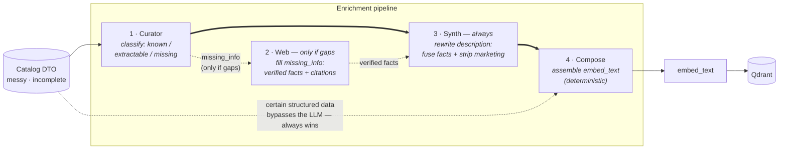
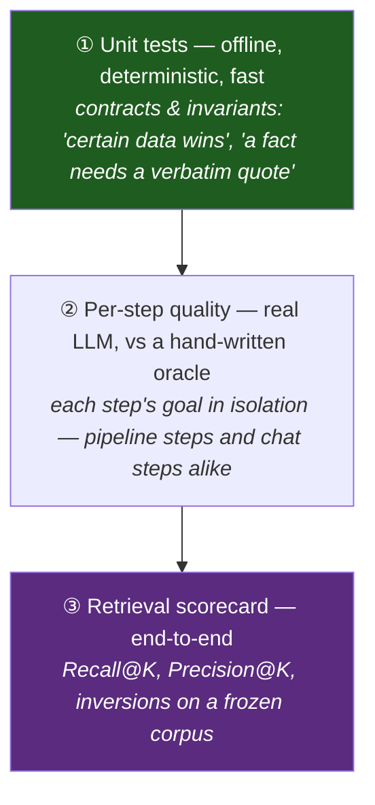
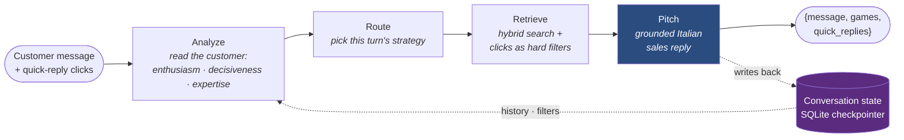

# Seller 🎲 — a RAG advisor that *sells* board games

[](https://github.com/msporchia/board-game-rag-seller/actions/workflows/ci.yml)

> **🔬 Personal research project.** A solo build to explore one idea properly — how to make
> semantic search over a messy product catalog actually *good* — and to practice
> production-shaped RAG (LangChain · Qdrant · FastAPI · Ollama). Local-first, offline-runnable,
> provider-swappable. Not a product; a place to do the engineering well.

## The problem this answers

A board-game shop has a wall of boxes to sell, and selling them is genuinely hard. Board games
are a *you-either-know-them-or-you-don't* category: most customers know **Monopoly and Risiko**
and quietly assume that's roughly what's inside every box. That there are **cooperative** games,
titles built on completely different mechanics, games for two, games that finish in fifteen
minutes — that whole space is invisible to them.

A guide that explains *"what board games are"* or *"which genres exist"* doesn't move anyone:
nobody buys a category. What sells is a **salesperson** — one who asks the **right few questions**,
opens up possibilities the customer didn't know to ask for, and lands on a **specific box on the
shelf they can buy today**. Not education — a guided path from a vague wish to one real game.

That conversation is what this project automates: it **understands vague requests**
(*"something cooperative and medieval for two"*), narrows down on concrete criteria (players,
duration, complexity), and only ever recommends **real, in-stock games** — never a
plausible-sounding title that isn't on the shelf.

The repo is two stories. **Part 1 — the retrieval engine**: done, measured, and the heart of
the project. **Part 2 — the conversational seller** on top of it: working end-to-end, being
finalized, measured the same way. Each part builds to its payoff: the mechanism first, then
what it does on real games.

---

# Part 1 — the retrieval engine

## The principle this project is built on

A real catalog is **heterogeneous and incomplete**: records arrive from different sources with
wildly different quality — some games richly described, many just a name and a few fields. Fed
raw to an embedder, that difference silently *becomes* the ranking: well-documented games
surface, thin ones disappear. Terraforming Mars at **#45** wasn't less relevant — it just had a
thinner record. That's not a ranking; it's a data-entry accident.

> **Every game must be equally findable and equally sellable, whatever the quality of its
> source data.** The system must never penalize a game for where its record came from. If one
> game is to outrank another, it must be **intentional** — margin, recent sales, a promotion —
> applied as an explicit layer, never inherited from data quality.

The lever that makes the principle enforceable:

> **Retrieval quality is decided by the text you embed — not only by the embedding model.**

An embedding is a *lossy semantic centroid* of its input (see [`docs/valutazione.md`](docs/valutazione.md)).
Feed it three paragraphs of marketing (*"epic legendary adventure!"*) and the centroid lands on
"vague epic", so a search for *"cooperative dungeon crawler"* can't tell the right game from the
wrong one. The embedder is fixed and query-agnostic; the **text** is the lever we control.
**Enrichment is the equalizer**: it turns the uneven input into *uniform, dense, factual,
search-friendly* records before embedding — adding signal, never inventing — so the retriever
ranks the *games*, not their data entry. (No intentional boost layer exists yet; today the
ranking is pure relevance, by design.) This is **representation engineering**, and the table
above is it, measured.

> #### 🇮🇹 Why the data, prompts and queries are in Italian
> The **code and docs are in English**; the **catalog text, LLM prompts and embedded/queried
> strings are Italian — on purpose.** This targets a real Italian board-game shop: the inputs are
> genuine Italian marketing DTOs and the web fixtures are **real Italian review pages**, scraped
> and frozen as-is. Translating them, or hand-crafting tidy English toy data, would quietly defeat
> the experiment — you'd be proving a *tailored* example works, not that the mechanism survives the
> messy, redundant, real-world prose it's actually built to handle. The realism **is** the test.

## Architecture


**Tech choices** (local-first, swap providers for prod — architecture unchanged):

| | Local (free, offline) | Production swap |
|---|---|---|
| Vector store | **Qdrant** (Docker) | same (managed) |
| Embeddings | `nomic-embed-text` (Ollama) | OpenAI `text-embedding-3` / `bge-m3` |
| LLM | `llama3.1` 8B (Ollama) | a stronger model (Claude / GPT-4-class) |
| Orchestration | LangChain · LangGraph · FastAPI | same |

## The enrichment pipeline

One record per game flows through four steps. The golden rule throughout: **certain data always
wins** — if the catalog states the player count, no LLM guess can override it.



| # | Step | What it does | Doc |
|---|------|--------------|-----|
| 1 | **Curator** | an LLM pass that classifies every fact as *known / extractable / missing* — **no invention**; every extraction backed by a verbatim quote | [01-curator](docs/enrichment/01-curator.md) |
| 2 | **Web** | **fallback — fires only when the Curator left gaps** (`missing_info`): searches trusted reviews and extracts verified facts, **each with a citation** checked against the page | [02-web](docs/enrichment/02-web.md) |
| 3 | **Synth** | **runs on every game** (not gated on gaps): rewrites the description to *(a)* fuse the recovered facts in so they reach `embed_text` — *the link that closed the loop* — and *(b)* strip marketing noise while keeping the theme/setting/mechanic words | [03-synth](docs/enrichment/03-synth.md) |
| 4 | **Compose** | deterministically assembles the `enriched` fields into the final `embed_text` — the **baseline to beat** | [04-compose](docs/enrichment/04-compose.md) |

→ Full rationale, data model, and per-step metrics: [`docs/enrichment/`](docs/enrichment/README.md).

## We decide with numbers, not vibes

Three evaluation levels, each with a distinct job — so a gain in one step can't hide a loss in
another:



Two principles run through all of it:
- **The oracle is never fed to the system** — it's the answer key, not an input.
- **We rank, we don't score.** Cosine similarity is uncalibrated (perfect vs wrong can be ~0.06
  apart), so "70%" means nothing; what matters is the *right games ranking above the wrong ones*.

And when the numbers say we **lost**, we write it down. The
[Synth-compresses-rich-DTOs regression](docs/showcase/viticulture.md) is documented in
[`e2e-findings.md`](docs/enrichment/e2e-findings.md) and pinned by an `xfail` test that turns
green only when it's fixed. The honest failures are part of the showcase on purpose.

---

## The results, on real games 🔍

Everything above, now measured. Three real catalog games, carried end-to-end through the
enrichment pipeline and ranked by the **real retriever** on a frozen 50-game corpus. Same
embedding model, same queries — only the embedded text changes:

| | Game | Before | After |
|---|------|--------|-------|
| 🚀 | [**Terraforming Mars**](docs/showcase/terraforming-mars.md) — thin entry, no description | rank **#45 / #47 / #47** of 50 | rank **#1 / #26 / #1** |
| 🔬 | [**Onitama**](docs/showcase/onitama.md) — rich prose, all atmosphere | genre invisible to search | genre recovered — **every fact carries a verbatim citation** |
| ⚖️ | [**Viticulture**](docs/showcase/viticulture.md) — already well-described | rank **#4** | rank **#23** — *worse*: an honest regression, kept visible |

What happens to each game, in plain words (every step linked if you want the mechanics):

- **Terraforming Mars** arrives with *no description* — to the embedder it's a spec sheet, and
  the query *"gioco di fantascienza per terraformare marte"* ranks it **#45**. The
  [Curator](docs/enrichment/01-curator.md) flags what's missing; the
  [Web step](docs/enrichment/02-web.md) recovers the missing facts from trusted reviews
  (*marte, ossigeno, oceani* — each backed by a quoted source); the
  [Synth step](docs/enrichment/03-synth.md) weaves them into clean prose. Same game, same
  embedder, same query: **#1**.
- **Onitama** has plenty of prose, but it's marketing (*"la magia… un viaggio nel cuore delle
  arti marziali"*) and never says *what kind of game it is*. The Web step fills exactly that
  gap — and keeps **only facts whose quote is literally present in the source page**; a model
  guess with no quote is thrown away, not embedded. The embedded text finally says it plainly:
  an abstract duel for two, decided by cards that pass to your opponent.
- **Viticulture** was already rich — and the pipeline made it **worse**. Synth compressed
  ~2300 chars to ~1200 and dropped *vino / toscana* signal, so a common query slipped off the
  first screen (#4 → #23). We kept the failure: it's written down in
  [`e2e-findings.md`](docs/enrichment/e2e-findings.md) and pinned by an `xfail` test that turns
  green only when it's fixed. A showcase that only shows wins is a sales brochure.

Each walkthrough shows the exact DTO in, the real computed baseline `embed_text`, the
verbatim-cited facts the pipeline adds, and the measured rank delta.
→ [Start here](docs/showcase/README.md).

---

# Part 2 — the conversational seller 💬 — 🚧 being finalized

This is the salesperson the problem at the top asked for. A customer who only knows *Monopoly*
won't browse a genre tree — so the seller doesn't show one. Each turn it **reads the message**,
decides **how to answer** (ask one clarifying question, explain a mechanic, or just propose), and
always lands on **real boxes on the shelf** — never an invented title. It's the Part 1 retrieval
engine, wrapped in a conversation that does the asking.

## A turn, end to end



Send a `session_id` and the turn carries memory across the conversation; omit it and the same
core runs as a single stateless pitch (`POST /chat` → retrieval → grounded reply). The contract
is the same either way: `{message, games, quick_replies}`.

## Why you can trust what it says

Two invariants are enforced **in code, never trusted to the model**:

- **Anti-hallucination grounding** — a pitched game must be in the retrieved set; an invented id
  is dropped *and its sales pitch goes with it*. The customer message is **assembled in code**
  from the surviving recommendations, so the prose can only ever describe games that are on the
  cards. The first measured failure — text and cards naming different games — is now
  **structurally impossible**, not patched after the fact.
- **Deterministic fallback** — if structured output fails, the turn degrades to an honest
  scripted reply over the retrieved games. No 500, no invented recommendation.

## Asking the right questions

The "right few questions" from the problem statement are a **strategy chosen per turn** from how
the customer reads — so a hesitant beginner and a decided enthusiast get different conversations:

| Strategy | When | What the turn does |
|----------|------|--------------------|
| **GUIDED** | undecided / beginner | 1–2 clear options **+ one simple question** to narrow down |
| **EXPLANATORY** | curious beginner | explain the mechanics in plain words and analogies |
| **DISCOVERY** | enthusiast | free-form, propose creatively across the catalog |
| **QUICK_MATCH** | decided — or the chat is stalling | 3–4 concrete games, **now** |

Routing is deterministic — decided in code, not asked of a prompt: a curious beginner gets
EXPLANATORY, a clearly-decided customer gets QUICK_MATCH, and **after 3 turns with no concrete
proposal the seller forces a QUICK_MATCH** so a conversation never loops forever without a
buyable answer. With every answer the seller also offers **tappable quick-reply buttons** (the `quick_replies`
in the contract) — suggested refinements about the *game*, like *"plays in under 30 minutes"* or
*"for two players"*. Tapping one isn't small talk: it becomes a **real search filter** on the
game's own attributes (its playtime, its player count), so every tap genuinely narrows the
catalog instead of being a decorative chip.

## Steering the seller — policies switched on by name

A storefront often needs to *bias* the seller — run a Christmas campaign, push a category, treat
this customer as an expert — without handing the client a free prompt field to inject into. So
the bias is a **list of named policies** on the request (`custom_policy: ["christmas_sale",
"promote_cooperative"]`); each name resolves to a small class in a registry, and an unknown name
is ignored, never an error.

A policy isn't a fixed setting — it's **middleware wrapped around the turn's stages**, so it does
exactly as much as it needs: `promote_cooperative` puts itself *in the middle of the fetch*
(biases the query, pulls cooperative games to the front), `christmas_sale` reshapes the *pitch*
(gift framing, no invented prices), `force_quick_match` overrides the routing. Adding a behavior
is **one file and one registry line** — the rest of the code doesn't move.

The boundary that keeps it safe: a policy changes **behavior, not truth**. `promote_cooperative`
can only reorder games that were actually retrieved; no policy can override the grounding rule. And
because each policy is one isolated class, its effect is **unit-tested on its own** — it keeps
doing its job even as the rest of the prompt changes around it. Design: [`docs/idee.md` §O](docs/idee.md).

## Pushing it further — three engines, one contract

Behind that same `reply(...)` contract sit interchangeable engines, switched by `CHAT_ENGINE`
(and per-request, for shadow runs):

- **pipeline** — the decomposed graph above: every decision (route, filters, k) made in code, the
  weak 8B does only the pitch.
- **piloted (arm B)** — a code-piloted agent loop: the model reformulates the search query into
  *catalog language* (it turns *"we all play together against the game"* into *"cooperative,
  win or lose as a team"* — the lexical gap the embedder can't bridge on its own), the code
  fetches, and a zero-result turn triggers one **informed** retry or an honest no-match.
- **agent** — *experimental*: the model drives a `search_catalog` tool itself, deciding when and
  with what words to search; the answer is still assembled in code over the union of what the tool
  returned (same grounding). Confirmed on a real model: the pipeline's `llama3.1:8b` can't drive
  tools — as predicted — but `qwen2.5:7b` runs the loop end-to-end (~8-10s/turn), searching itself
  *and* using the structured filters (`players=2`, not buried in the query text). Every tool call
  is recorded (`{query, filters, hits}`) so tool-use quality is measurable, the tool tolerates the
  model's malformed args, and a failed turn still degrades to the pipeline.

Measured head to head on the same fixtures, arm B lifted **case pass 0.700 → 0.800 at −18%
tokens** — more quality *and* cheaper. The **agent** runs end-to-end but has no *scored* numbers
yet — the next step is pointing the same ChatConversation harness at `engine=agent`. `TieredChat`
degrades a failed primary turn to the pipeline so the customer always gets an answer. Full design +
the per-failure breakdown (what recovered, what merely *moved*, the one predicted regression):
[`docs/idee.md` §Q](docs/idee.md).

## Measured the same way as the pipeline

Real LLM, hand-written oracles, one suite per node, plus a whole-conversation suite that replays
scripted multi-turn sessions through the production engine — still rule-scored, never an
unreadable end-to-end blob:

| Suite | What it measures |
|-------|------------------|
| [TurnAnalyzer](tests/eval/TurnAnalyzer) | reading the customer: per-dimension accuracy (enthusiasm, decisiveness, expertise, …) vs labeled turns |
| [ChatPitch](tests/eval/ChatPitch) | the pitch: how often the model delivers a *grounded* recommendation instead of the fallback, per strategy |
| [ChatRetrieve](tests/eval/ChatRetrieve) | conversational query assembly: recall@k of the games the turn should surface |
| [ChatConversation](tests/eval/ChatConversation) | full multi-turn sessions on the production engine — `CHAT_ENGINE` picks the arm under eval (pipeline graph · piloted loop · the **agent** tool-loop on qwen2.5:7b): convergence to an accepted game, filter integrity across turns, the forced-proposal rule, fallback rate per turn, plus LLM calls/tokens per conversation so arms compare as Δquality next to Δcost |

**Latest measured results: [`tests/eval/RESULTS.md`](tests/eval/RESULTS.md)** — regenerated at
the end of every eval run: one headline per suite, and per-case failures with everything needed
to judge them (the conversation, expected vs got, the oracle note, the model's full reading).

**"Ok, but what did it actually produce?"** The agent run is exported as a human-readable
[review bundle](tests/eval/ChatConversation/REVIEW.md) — every search the model ran, every reply it
wrote, and the games that were available, laid next to the goal and a rubric for the things a pass
rate can't score (aptness, invented constraints, tone, giving up too early). Nothing is hidden
behind the number: it's meant to be read by a human or handed to a stronger model for review
(`python -m tests.eval.ChatConversation.export_review`). The numbers are also honestly noisy — the
agent is stochastic, so the same 15 cases scored 0.60 / 0.80 / 0.87 across three runs.

## What a session looks like

*Simulated transcript — it shows the target shape and will be replaced by a real recorded
session once the layer is finalized; the before → after walkthrough is staged in
[`docs/showcase/chat.md`](docs/showcase/chat.md).*

> 🧑 *«Cerco un gioco cooperativo per due, niente di troppo impegnativo»*
>
> 🤖 *«Se giocate in due e volete collaborare, ho due proposte: **Pandemic** — si vince o si
> perde insieme, regole spiegate in dieci minuti — e **Codenames Duet**, perfetto se vi
> piacciono i giochi di parole.»*
> &nbsp;&nbsp;🎴 `[Pandemic] [Codenames Duet]` · quick replies: `[max 30 minuti] [più strategico] [un'altra idea]`
>
> 🧑 click su `max 30 minuti`
>
> 🤖 *«Allora **Codenames Duet** è il candidato perfetto: partite da un quarto d'ora e tanta
> voglia di rivincita.»* — il click è diventato un filtro `duration ≤ 30` sulla ricerca reale.

*A demo GIF of a real session will land here.*

## Still being finalized 🚧

Honest status — this layer is still a work in progress; these pieces just aren't done yet:

- **Pitch quality on the local 8B is the open bottleneck.** The *mechanics* hold end-to-end
  (grounding, memory, fallback, traces — no 500s), but the 8B's sales copy is thin. The stance:
  *if it works on the 8B, it flies on a stronger model* — design notes in
  [`docs/chat.md`](docs/chat.md) · [`docs/seller.md`](docs/seller.md).
- **The transcript above is simulated.** A real recorded session + demo GIF land here once the
  layer is signed off.
- **The autonomous agent (arm A) and the tier circuit breaker are designed, not built** — see
  [`docs/idee.md` §Q](docs/idee.md).

---

## Quickstart (self-contained, offline)

The stack runs without a real PrestaShop/MySQL: a bundled **mock** serves a small synthetic demo
catalog (`mock/sample-catalog.json`) over the same contract. Point `MOCK_CATALOG` at your own
JSON to run a larger catalog — see [`.env.example`](.env.example).

```bash
# 1. Start the stack (Qdrant + Ollama + API + mock catalog)
docker compose up -d
#    (NVIDIA GPU optional: add -f docker-compose.gpu.yml — the LLM steps are slow on CPU)

# 2. Pull the models into Ollama (ONCE — the container starts empty)
docker exec seller-ollama ollama pull nomic-embed-text   # embeddings (ingest/search)
docker exec seller-ollama ollama pull llama3.1            # LLM (enrichment/eval)

# 3. Ingest the demo catalog (runs the full Curator → Web → Synth → Compose pipeline)
docker compose exec seller-api python -m app.ingestion.ingester

# 4. Search
curl "http://localhost:8000/search?q=cooperativo+fantasy+per+due&k=5"

# 5. Chat (stateless; add "session_id" to the body for the stateful conversation)
curl -X POST http://localhost:8000/chat -H "Content-Type: application/json" \
     -d '{"message": "un gioco cooperativo per due, non troppo lungo"}'
```

**Verify:** Seller API → http://localhost:8000/health · Mock → http://localhost:8001/health ·
Qdrant → http://localhost:6333/dashboard · Ollama → http://localhost:11434

## Tests & eval

```bash
docker compose exec seller-api python -m pytest tests/unit -q                          # deterministic, offline
docker compose exec seller-api python -m pytest tests/eval/ChatPitch -q                 # per-step quality, real LLM (one suite per step)
docker compose exec -e PYTHONPATH=/app seller-api python tests/eval.py --suite core --k 5 --pipeline synth  # retrieval scorecard
docker exec seller-api python -m pytest tests/e2e/enrichment -v                         # real end-to-end (LLM + web replay)
```

Observability is in place — structured logging (structlog) and swappable LLM call tracing —
and what we measure vs what we're still blind to is tracked in
[`docs/observability.md`](docs/observability.md).

## Project structure

```
seller/
├── docker-compose.yml          # qdrant + ollama + api + mock catalog
├── mock/                       # mock PrestaShop "seller" endpoint (serves the DTO contract)
├── app/
│   ├── config.py               # env: Qdrant/Ollama/models/source
│   ├── api/                    # FastAPI routers (/health, /search, /chat)
│   ├── chat/                   # advisor (grounded pitch) + LangGraph conversation (state · routing · memory)
│   ├── ingestion/
│   │   ├── enricher/           # the pipeline: curator · web · synth · compose
│   │   ├── ingester.py         # build_pipeline() + run
│   │   └── serializer.py       # GameDoc → embeddable Document
│   ├── core/                   # vector store · enrichment store · web search · logging · tracing
│   └── rag/                    # hybrid retriever + filters
├── docs/
│   ├── enrichment/             # one doc per pipeline step (the "why & how we know")
│   ├── showcase/               # before → after walkthroughs on real games  ← start here
│   ├── chat.md                 # the conversational layer: design, findings, eval
│   ├── valutazione.md          # how embeddings work & how we measure
│   └── observability.md        # eval & observability: status and roadmap
└── tests/                      # unit (deterministic) · eval (real LLM, one suite per step) · e2e
```

## Data source

By default the API ingests from the bundled mock (synthetic sample catalog). Point `MOCK_CATALOG`
at your own dataset, or point `PRESTASHOP_BASE_URL` at a real PrestaShop "seller" endpoint to
ingest a live catalog — see [`.env.example`](.env.example) and
[`docs/pipeline-dati.md`](docs/pipeline-dati.md).
