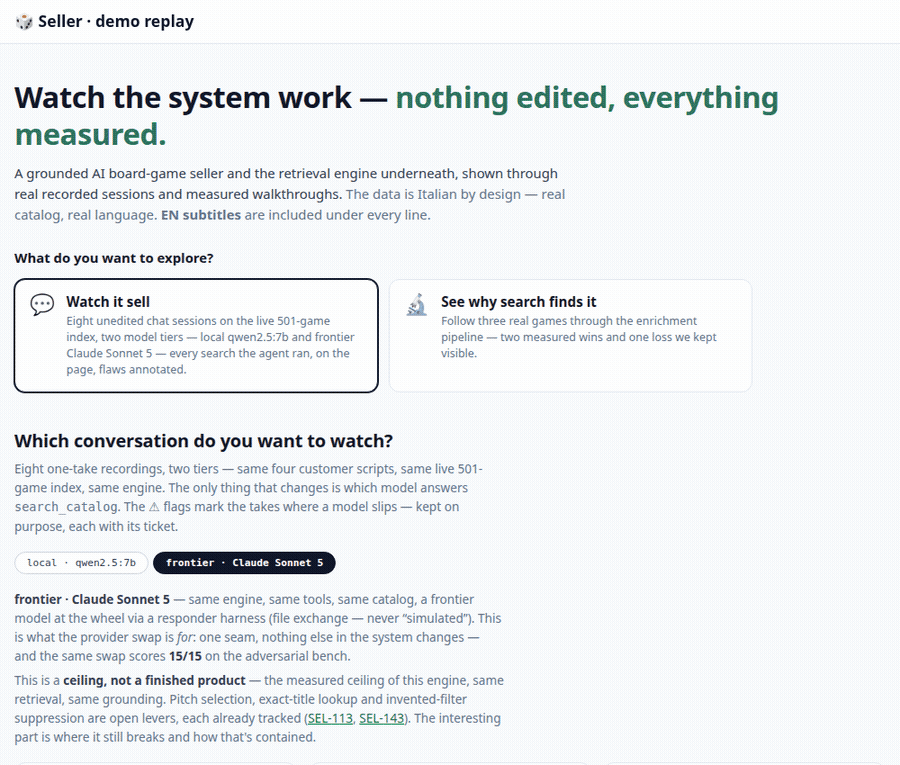
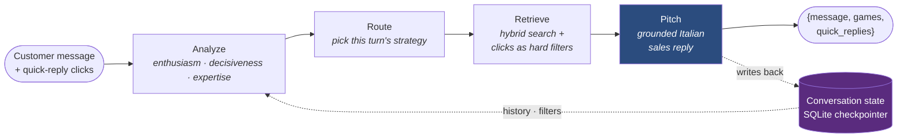

# Seller 🎲 — a RAG advisor that *sells* board games

[](https://github.com/msporchia/board-game-rag-seller/actions/workflows/ci.yml)

An AI salesclerk for a real Italian board-game catalog: it understands vague wishes
(*"something cooperative and medieval for two"*), asks the right few questions, and only ever
recommends **real, in-stock games** — never an invented title. A personal research project built
to do one thing properly — make semantic search over a messy product catalog actually *good* —
with **every claim measured** (LangChain · LangGraph · Qdrant · FastAPI · Ollama; local-first,
offline-runnable, provider-swappable). It is the AI brain of a three-repo storefront, consumed by
a [Node + TypeScript commerce BFF](https://github.com/msporchia/board-game-shop-api) and a
[React storefront](https://github.com/msporchia/board-game-shop-web).

[](https://msporchia.github.io/board-game-rag-seller/demo/)

**[▶ Explore the interactive demo](https://msporchia.github.io/board-game-rag-seller/demo/)** —
**watch it sell** (four unedited sessions on the live 501-game index, with every search the agent
ran on the page) or **follow a real game through the enrichment pipeline** (two measured wins and
the loss we kept). Nothing in it is hand-crafted: sessions are recorded in-process and the demo
regenerates from them.

## The proof, in three numbers

| | Measured | Proof |
|---|---|---|
| A thin record made findable | rank **#45 → #1** of 50 — same embedder, same query, only the embedded text changes | [demo](https://msporchia.github.io/board-game-rag-seller/demo/) · [walkthrough](docs/showcase/terraforming-mars.md) |
| One measured day, frozen rulers | ranking quality (mean NDCG) **0.386 → 0.726**; conversational recall **0.545 → 0.818** | [experiments ledger](docs/experiments.md) |
| Invented recommendations | **structurally impossible** — grounding is enforced in code, not asked of the model | [ADR-0002](docs/adr/0002-grounding-enforced-in-code.md) |

*An R&D repo that hides its losses isn't one. The same rulers also recorded an honest regression
we kept visible (**#4 → #23**, [pinned by a red test](docs/showcase/viticulture.md)) and falsified
two comfortable hypotheses — one ledger row per change, each with its re-runnable command, in
[`docs/experiments.md`](docs/experiments.md).*

## The problem this answers

Board games are a *you-either-know-them-or-you-don't* category: most customers know Monopoly and
Risiko and quietly assume that's what's inside every box. A guide that explains "which genres
exist" moves nobody — nobody buys a category. What sells is a **salesperson**: one who asks the
right few questions, opens up possibilities the customer didn't know to ask for, and lands on a
**specific box on the shelf they can buy today**.

That conversation is what this project automates. The repo is two stories: **Part 1 — the
retrieval engine** (done, measured, the heart of the project) and **Part 2 — the conversational
seller** on top of it (working end-to-end, measured the same way).

---

# Part 1 — the retrieval engine

A real catalog is heterogeneous and incomplete: some games arrive richly described, many are a
name and a few fields. Fed raw to an embedder, that difference silently *becomes* the ranking —
Terraforming Mars at **#45** wasn't less relevant, it just had a thinner record. That's not a
ranking; it's a data-entry accident.

> **Every game must be equally findable and equally sellable, whatever the quality of its source
> data.** If one game is to outrank another, it must be intentional — margin, a promotion —
> applied as an explicit layer, never inherited from data quality.

The lever that makes the principle enforceable: **retrieval quality is decided by the text you
embed — not only by the embedding model** (an embedding is a *lossy semantic centroid* of its
input; see [`docs/valutazione.md`](docs/valutazione.md)). **Enrichment is the equalizer**: it
turns uneven records into uniform, dense, factual, search-friendly text before embedding — adding
signal, never inventing. This is representation engineering, and it is measured end-to-end.

> #### 🇮🇹 Why the data, prompts and queries are in Italian
> Code and docs are English; catalog text, LLM prompts and embedded strings are **Italian on
> purpose** — real marketing DTOs and real frozen review pages from an Italian catalog. Tidy
> English toy data would prove a *tailored* example works, not that the mechanism survives real
> messy prose. The realism **is** the test.

## Architecture


**Tech choices** (local-first; swap providers for prod — architecture unchanged):

| | Local (free, offline) | Production swap |
|---|---|---|
| Vector store | **Qdrant** (Docker) | same (managed) |
| Embeddings | `bge-m3` (Ollama; replaced `nomic-embed-text` on [measured evidence](docs/experiments.md)) | OpenAI `text-embedding-3` / managed |
| LLM | `llama3.1` 8B + `qwen2.5:7b` for the agent tier (Ollama) | a stronger model (Claude / GPT-4-class) |
| Orchestration | LangChain · LangGraph · FastAPI | same |

## The enrichment pipeline

One record per game, four steps. The golden rule throughout: **certain data always wins** — if
the catalog states the player count, no LLM guess can override it.

| # | Step | What it does | Doc |
|---|------|--------------|-----|
| 1 | **Curator** | LLM pass that classifies every fact as *known / extractable / missing* — **no invention**, every extraction backed by a verbatim quote | [01-curator](docs/enrichment/01-curator.md) |
| 2 | **Web** | fallback, fires only on gaps: recovers facts from trusted reviews, **each with a citation verified against the page** | [02-web](docs/enrichment/02-web.md) |
| 3 | **Synth** | runs on every game: fuses recovered facts into dense prose, strips marketing noise | [03-synth](docs/enrichment/03-synth.md) |
| 4 | **Compose** | deterministically assembles the final `embed_text` — the baseline to beat | [04-compose](docs/enrichment/04-compose.md) |

We decide with numbers, not vibes — three eval levels so a gain in one step can't hide a loss in
another: **unit tests** (contracts: "certain data wins", "a fact needs a verbatim quote"),
**per-step quality** (real LLM vs a hand-written oracle, never fed to the system), and an
**end-to-end retrieval scorecard** (Recall@K / NDCG on a frozen corpus — we *rank*, we don't
trust uncalibrated similarity scores; [ADR-0004](docs/adr/0004-rank-not-score.md)).

## The results, on real games

Three real catalog games, carried end-to-end and ranked by the real retriever on a frozen
50-game corpus — same embedder, same queries, only the embedded text changes:

| | Game | What it demonstrates | Before → after |
|---|------|----------------------|----------------|
| 🚀 | [**Terraforming Mars**](docs/showcase/terraforming-mars.md) | the recovery: a thin record made findable | rank **#45 → #1** |
| 🔬 | [**Onitama**](docs/showcase/onitama.md) | the guarantee: every added fact carries a verified verbatim quote; a plausible guess with no quote is **dropped** | fabrication → discarded |
| ⚖️ | [**Viticulture**](docs/showcase/viticulture.md) | the honest loss: Synth compressed an already-rich record and lost signal — kept, pinned by an `xfail` test | rank **#4 → #23** |

> ⚡ **See it live:** [follow each game through the pipeline, step by step, in the interactive
> demo](https://msporchia.github.io/board-game-rag-seller/demo/) — or read the
> [written walkthroughs](docs/showcase/README.md) with the exact fixtures.

---

# Part 2 — the conversational seller 💬

The salesperson the problem asked for: each turn it reads the customer, decides how to answer
(ask one clarifying question, explain a mechanic, or just propose), and always lands on real
boxes on the shelf.



Two invariants are enforced **in code, never trusted to the model**: a pitched game must be in
the retrieved set (an invented id is dropped *and its sales pitch goes with it* — the reply is
assembled in code from the survivors), and a failed structured output degrades to an honest
scripted reply, never a 500. The strategy (GUIDED · EXPLANATORY · DISCOVERY · QUICK_MATCH) is
routed deterministically from how the customer reads, and after 3 turns with no concrete proposal
a QUICK_MATCH is forced. Quick-reply buttons aren't decorative: a tap becomes a **real search
filter** on the game's own attributes. Storefront bias (a Christmas campaign, push a category)
enters as **named policies** — small registered classes wrapped around the turn's stages, never a
free prompt field; a policy changes behavior, not truth. Design: [`docs/idee.md`](docs/idee.md) ·
full chat design & findings: [`docs/chat.md`](docs/chat.md).

## Three engines, one contract

Behind the same `reply(...)` contract sit three interchangeable engines, switched by
`CHAT_ENGINE` ([ADR-0003](docs/adr/0003-interchangeable-chat-engines.md)): **pipeline** (every
decision in code, the weak 8B only pitches), **piloted** (a code loop, the model reformulates the
query into catalog language), and **agent** (the model drives a `search_catalog` tool itself —
`qwen2.5:7b` runs the loop end-to-end, and every tool call is recorded as `{query, filters,
hits}` so tool-use quality is measurable).

| engine | who drives the search | case pass | note |
|--------|-----------------------|:---------:|------|
| pipeline | deterministic code | 0.667 | re-baselined 2026-07-03 |
| piloted | code loop, model reformulates | 0.80 · −18% tok | June bench |
| agent | the model itself, via a tool | **0.733** | both cooperative cases pass |

Single runs are samples, not verdicts (the same 15 cases scored 0.60/0.80/0.87 on identical
inputs) — and this isn't a leaderboard but a **quality/cost curve**: which arm a storefront runs
is an economic call. `TieredChat` degrades a failed primary turn to the pipeline so the customer
always gets an answer. Eval: one suite per node plus whole-conversation replays, all rule-scored
against hand-written oracles — latest results in [`tests/eval/RESULTS.md`](tests/eval/RESULTS.md),
every reply the seller actually wrote in the
[review bundle](tests/eval/ChatConversation/REVIEW.md).

> ⚡ **Watch it sell:** [four unedited sessions on the live 501-game index in the interactive
> demo](https://msporchia.github.io/board-game-rag-seller/demo/) — every search the agent
> composed, the FORCED safety-net turns, the flaws annotated with their tickets. Written version:
> [`docs/showcase/live-session.md`](docs/showcase/live-session.md).

A taste — the anti-hallucination rule and the click→filter mechanic on real catalog games
(case `infeasibile-recupero`, verbatim):

> 🧑 *«in pausa pranzo io e un collega abbiamo solo cinque minuti liberi»* · click `[per 2 giocatori] [max 5 minuti]`
>
> 🤖 *«Al momento non ho in catalogo un gioco che corrisponde bene a quello che cerchi…»*
> &nbsp;&nbsp;— `duration ≤ 5` matches **nothing**, so the seller says so. No cards, no invented game.
>
> 🧑 *«ok, in realtà possiamo arrivare a mezz'ora»* · click `[max 30 minuti]`
>
> 🤖 *«**Onitama** è perfetto per voi: un duello veloce e strategico… in solo 10 minuti!…»*
> &nbsp;&nbsp;— the click became a real `duration ≤ 30` filter; games reappear, both really in stock.

**Known limits, tracked 🚧** — every open edge has a ticket or a red eval pinning it: pitch
quality on the local 7-8B is the open bottleneck (the [simulation
harness](tests/eval/ChatConversation/simulation/) measures how much a stronger model recovers);
constraint *reversal* across turns is still red; the model going silent on later turns was floored
the same day it was caught
([SEL-147](docs/tickets/resolved/SEL-147-agent-false-nomatch-coop-two.md)); the cooperative
verdict policy is a declared stopgap
([SEL-146](docs/tickets/SEL-146-cooperative-verdict-revisit.md)).

---

## Choose your path 🧭

You know best what you care about — every row is a self-contained entry point:

| You're interested in… | Start here | What you'll find |
|---|---|---|
| **Seeing it work, right now** | [▶ the interactive demo](https://msporchia.github.io/board-game-rag-seller/demo/) | real sessions replayed turn by turn · a game's journey through the pipeline |
| **RAG / representation engineering** | [Terraforming Mars #45→#1](docs/showcase/terraforming-mars.md) → [enrichment/](docs/enrichment/README.md) | why the embedded text beats the embedder |
| **Agents & tool-use** | [live sessions](docs/showcase/live-session.md) → [chat design](docs/chat.md) | a 7B driving its own search, every call recorded |
| **How to measure an LLM system** | [experiments ledger](docs/experiments.md) → [RESULTS.md](tests/eval/RESULTS.md) → [valutazione.md](docs/valutazione.md) | frozen rulers, before→after, rank-not-score |
| **Honest engineering (what does NOT work)** | [Viticulture, the kept regression](docs/showcase/viticulture.md) → [e2e-findings](docs/enrichment/e2e-findings.md) → [tickets/](docs/tickets/README.md) | measured failures, pinned by `xfail`, tracked |
| **The non-obvious decisions** | [ADRs](docs/adr/README.md) | the forks with a defensible alternative we rejected |
| **Running it yourself** | [Quickstart](#quickstart-self-contained-offline) ↓ | the full stack, offline, in 5 commands |

## Quickstart (self-contained, offline)

The stack runs without a real PrestaShop/MySQL: a bundled **mock** serves a synthetic demo
catalog over the same contract (point `MOCK_CATALOG` at your own JSON for a larger one — see
[`.env.example`](.env.example) and [`docs/pipeline-dati.md`](docs/pipeline-dati.md)).

```bash
# 1. Start the stack (Qdrant + Ollama + API + mock catalog)
docker compose up -d
#    (NVIDIA GPU optional: add -f docker-compose.gpu.yml — the LLM steps are slow on CPU)

# 2. Pull the models into Ollama (ONCE — the container starts empty)
docker exec seller-ollama ollama pull bge-m3       # embeddings (ingest/search)
docker exec seller-ollama ollama pull llama3.1     # LLM (enrichment/eval)
docker exec seller-ollama ollama pull qwen2.5:7b   # LLM for the agent chat tier (optional)

# 3. Ingest the demo catalog (runs the full Curator → Web → Synth → Compose pipeline)
docker compose exec seller-api python -m app.ingestion.ingester

# 4. Search
curl "http://localhost:8000/search?q=cooperativo+fantasy+per+due&k=5"

# 5. Chat (stateless; add "session_id" to the body for the stateful conversation)
curl -X POST http://localhost:8000/chat -H "Content-Type: application/json" \
     -d '{"message": "un gioco cooperativo per due, non troppo lungo"}'
```

**Verify:** Seller API → http://localhost:8000/health · Mock → http://localhost:8001/health ·
Qdrant → http://localhost:6333/dashboard · Ollama → http://localhost:11434

## Tests & eval

```bash
docker compose exec seller-api python -m pytest tests/unit -q                          # deterministic, offline
docker compose exec seller-api python -m pytest tests/eval/ChatPitch -q                 # per-step quality, real LLM
docker compose exec -e PYTHONPATH=/app seller-api python tests/eval.py --suite core --k 5 --pipeline synth  # retrieval scorecard
docker exec seller-api python -m pytest tests/e2e/enrichment -v                         # real end-to-end (LLM + web replay)
```

Observability (structlog + swappable LLM tracing) and what we're still blind to:
[`docs/observability.md`](docs/observability.md).

## Project structure

```
seller/
├── docker-compose.yml          # qdrant + ollama + api + mock catalog
├── mock/                       # mock PrestaShop "seller" endpoint (serves the DTO contract)
├── app/
│   ├── api/                    # FastAPI routers (/health, /search, /chat)
│   ├── chat/                   # advisor (grounded pitch) + LangGraph conversation + engines
│   ├── ingestion/enricher/     # the pipeline: curator · web · synth · compose
│   ├── core/                   # vector store · enrichment store · web search · logging · tracing
│   └── rag/                    # hybrid retriever + filters
├── docs/
│   ├── demo/                   # the interactive demo (GitHub Pages) + its recording scripts
│   ├── showcase/               # before → after walkthroughs on real games
│   ├── enrichment/             # one doc per pipeline step (the "why & how we know")
│   ├── adr/                    # architecture decision records
│   ├── tickets/                # the working backlog (one file per ticket)
│   └── experiments.md          # the measurement ledger — one row per change
└── tests/                      # unit (deterministic) · eval (real LLM, one suite per step) · e2e
```

## Decisions & backlog

The non-obvious forks — the ones with a defensible alternative we rejected — are short
[architecture decision records](docs/adr/README.md). What's open or planned lives in the
[ticket backlog](docs/tickets/README.md): one file per item, traced back to the design notes it
came from.
