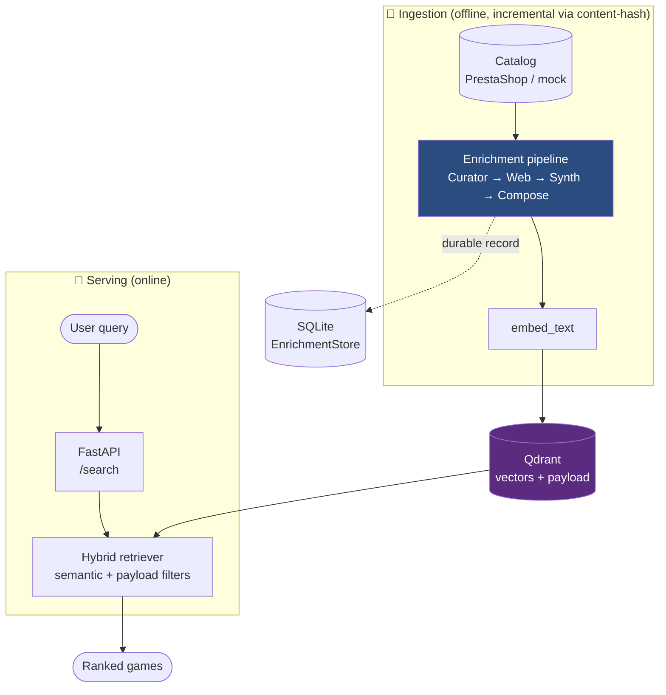
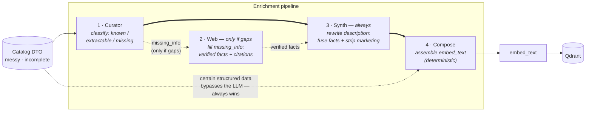
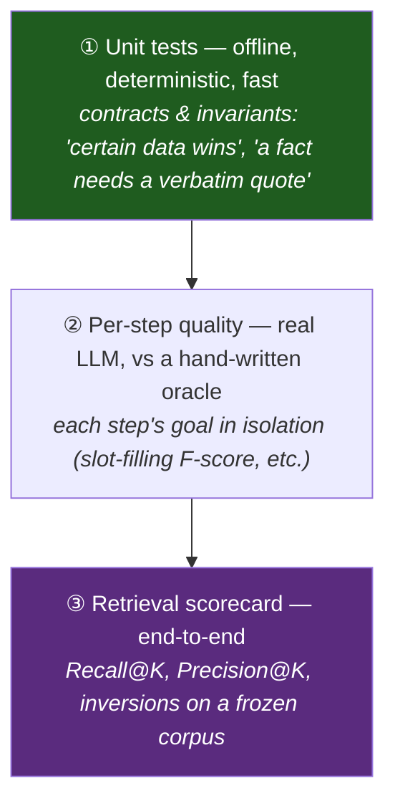

# Seller 🎲 — a RAG advisor that *sells* board games

[](https://github.com/msporchia/board-game-rag-seller/actions/workflows/ci.yml)

> **🔬 Personal research project.** A solo build to explore one idea properly — how to make
> semantic search over a messy product catalog actually *good* — and to practice
> production-shaped RAG (LangChain · Qdrant · FastAPI · Ollama). Local-first, offline-runnable,
> provider-swappable. Not a product; a place to do the engineering well.

A conversational "salesperson" for a board-game shop: instead of a keyword search, it
**understands vague requests** (*"something cooperative and medieval for two"*), filters on
concrete criteria (players, duration, complexity), and recommends **only real, in-stock games**
— never a hallucinated title.

But the chatbot is the easy half. The hard, interesting half — and the heart of this repo — is
the **enrichment pipeline** that decides *what text gets embedded*. That's where the quality
comes from, and where the engineering is.

---

## The one idea this project is built on

> **Retrieval quality is decided by the text you embed — not only by the embedding model.**

An embedding is a *lossy semantic centroid* of its input (see [`docs/valutazione.md`](docs/valutazione.md)).
Feed it three paragraphs of marketing (*"epic legendary adventure!"*) and the centroid lands on
"vague epic", so a search for *"cooperative dungeon crawler"* can't tell the right game from the
wrong one. The embedder is fixed and query-agnostic; the **text** is the lever we control.

Real catalogs make this worse: they're **heterogeneous and incomplete** — some games are richly
described, many are a name and a few fields. Fed raw, the thin ones get buried and the verbose
ones get diluted.

**Enrichment** is the set of steps that turn that messy input into *uniform, dense, factual,
search-friendly* records before embedding — adding signal, never inventing. This is
**representation engineering**, and it's measurable:

> A thin catalog entry for **Terraforming Mars** ranks **#45 / #47 / #47** out of 50.
> After the pipeline recovers its missing facts from the web, the *same game* ranks
> **#1 / #26 / #1** — no change of embedding model, no change of query.
> → [See the full walkthrough](docs/showcase/terraforming-mars.md).

> #### 🇮🇹 Why the data, prompts and queries are in Italian
> The **code and docs are in English**; the **catalog text, LLM prompts and embedded/queried
> strings are Italian — on purpose.** This targets a real Italian board-game shop: the inputs are
> genuine Italian marketing DTOs and the web fixtures are **real Italian review pages**, scraped
> and frozen as-is. Translating them, or hand-crafting tidy English toy data, would quietly defeat
> the experiment — you'd be proving a *tailored* example works, not that the mechanism survives the
> messy, redundant, real-world prose it's actually built to handle. The realism **is** the test.

---

## Architecture



**Tech choices** (local-first, swap providers for prod — architecture unchanged):

| | Local (free, offline) | Production swap |
|---|---|---|
| Vector store | **Qdrant** (Docker) | same (managed) |
| Embeddings | `nomic-embed-text` (Ollama) | OpenAI `text-embedding-3` / `bge-m3` |
| LLM | `llama3.1` 8B (Ollama) | a stronger model (Claude / GPT-4-class) |
| Orchestration | LangChain · FastAPI | same |

---

## The enrichment pipeline

One record per game flows through four steps. The golden rule throughout: **certain data always
wins** — if the catalog states the player count, no LLM guess can override it.



| # | Step | What it does | Doc |
|---|------|--------------|-----|
| 1 | **Curator** | an LLM pass that classifies every fact as *known / extractable / missing* — **no invention**; every extraction backed by a verbatim quote | [01-curator](docs/enrichment/01-curator.md) |
| 2 | **Web** | **fallback — fires only when the Curator left gaps** (`missing_info`): searches trusted reviews and extracts verified facts, **each with a citation** checked against the page | [02-web](docs/enrichment/02-web.md) |
| 3 | **Synth** | **runs on every game** (not gated on gaps): rewrites the description to *(a)* fuse the recovered facts in so they reach `embed_text` — *the link that closed the loop* — and *(b)* strip marketing noise while keeping the theme/setting/mechanic words | [03-synth](docs/enrichment/03-synth.md) |
| 4 | **Compose** | deterministically assembles the `enriched` fields into the final `embed_text` — the **baseline to beat** | [04-compose](docs/enrichment/04-compose.md) |

→ Full rationale, data model, and per-step metrics: [`docs/enrichment/`](docs/enrichment/README.md).

---

## See it on a real game 🔍

The claim above isn't a slogan — here are three real games carried **before → after** through
the pipeline, each with the measured effect on retrieval:

| Walkthrough | Shows | Headline |
|-------------|-------|----------|
| 🚀 [**Terraforming Mars**](docs/showcase/terraforming-mars.md) | enrichment **recovers** a thin entry | rank **#45 → #1** |
| 🔬 [**Onitama**](docs/showcase/onitama.md) | the **anti-hallucination** discipline | every recovered fact carries a verbatim quote |
| ⚖️ [**Viticulture**](docs/showcase/viticulture.md) | an **honest regression** we measured | full pipeline ranks *worse* — and the open test that tracks it |

Each shows the exact DTO in, the real (computed) baseline `embed_text`, the verbatim-cited facts
the pipeline adds, and the rank delta from the real retriever. → [Start here](docs/showcase/README.md).

---

## We decide with numbers, not vibes

Three evaluation levels, each with a distinct job — so a gain in one step can't hide a loss in
another:



Two principles run through all of it:
- **The oracle is never fed to the system** — it's the answer key, not an input.
- **We rank, we don't score.** Cosine similarity is uncalibrated (perfect vs wrong can be ~0.06
  apart), so "70%" means nothing; what matters is the *right games ranking above the wrong ones*.

And when the numbers say we **lost**, we write it down. The
[Synth-compresses-rich-DTOs regression](docs/showcase/viticulture.md) is documented in
[`FINDINGS.md`](tests/e2e/enrichment/FINDINGS.md) and pinned by an `xfail` test that turns green
only when it's fixed. The honest failures are part of the showcase on purpose.

---

## 💬 The chatbot — 🚧 in progress

The retrieval layer (this repo's focus) is the foundation; the conversational "salesperson" on
top is the next stage, built in two steps:

- **✅ Phase 4 — grounded pitch (first cut).** A stateless `POST /chat` retrieves real games and
  has the LLM write a short Italian sales pitch + quick-reply buttons, in a structured
  `{message, games, quick_replies}` contract. Two invariants are enforced in code, not trusted to
  the model: **anti-hallucination** (a featured game must be in the retrieved set — invented ids
  are dropped) and a **deterministic fallback** when the 8B's structured output fails.
- **🚧 Phase 5 — conversation.** A stateful LangGraph over that core: session memory, adaptive
  strategy routing, quick-reply clicks turned into filters, live price/stock from PrestaShop, and
  Haiku→Sonnet model tiering.

The honest first-run findings (grounding holds; the 8B can't keep prose and card-selection
coherent — a stronger model fixes it) are written up, before→after, in
[`docs/chat.md`](docs/chat.md). Design in [`docs/seller.md`](docs/seller.md).

*A demo GIF of a simulated chat will land here once the conversational layer is wired up.*

---

## Quickstart (self-contained, offline)

The stack runs without a real PrestaShop/MySQL: a bundled **mock** serves a small synthetic demo
catalog (`mock/sample-catalog.json`) over the same contract. Point `MOCK_CATALOG` at your own
JSON to run a larger catalog — see [`.env.example`](.env.example).

```bash
# 1. Start the stack (Qdrant + Ollama + API + mock catalog)
docker compose up -d
#    (NVIDIA GPU optional: add -f docker-compose.gpu.yml — the LLM steps are slow on CPU)

# 2. Pull the models into Ollama (ONCE — the container starts empty)
docker exec seller-ollama ollama pull nomic-embed-text   # embeddings (ingest/search)
docker exec seller-ollama ollama pull llama3.1            # LLM (enrichment/eval)

# 3. Ingest the demo catalog (runs the full Curator → Web → Synth → Compose pipeline)
docker compose exec seller-api python -m app.ingestion.ingester

# 4. Search
curl "http://localhost:8000/search?q=cooperativo+fantasy+per+due&k=5"
```

**Verify:** Seller API → http://localhost:8000/health · Mock → http://localhost:8001/health ·
Qdrant → http://localhost:6333/dashboard · Ollama → http://localhost:11434

## Tests & eval

```bash
docker compose exec seller-api python -m pytest tests/unit -q                          # deterministic, offline
docker compose exec -e PYTHONPATH=/app seller-api python tests/eval.py --suite core --k 5 --pipeline synth  # retrieval scorecard
docker exec seller-api python -m pytest tests/e2e/enrichment -v                         # real end-to-end (LLM + web replay)
```

What we measure today, what we're still blind to, and the roadmap (logging, tracing,
chat-level evals): [`docs/observability.md`](docs/observability.md).

## Project structure

```
seller/
├── docker-compose.yml          # qdrant + ollama + api + mock catalog
├── mock/                       # mock PrestaShop "seller" endpoint (serves the DTO contract)
├── app/
│   ├── config.py               # env: Qdrant/Ollama/models/source
│   ├── api/                    # FastAPI routers (/health, /search, /chat)
│   ├── chat/                   # conversational advisor: retrieve → grounded pitch (Phase 4)
│   ├── ingestion/
│   │   ├── enricher/           # the pipeline: curator · web · synth · compose
│   │   ├── ingester.py         # build_pipeline() + run
│   │   └── serializer.py       # GameDoc → embeddable Document
│   ├── core/                   # vector store · enrichment store · web search
│   └── rag/                    # retriever
├── docs/
│   ├── enrichment/             # one doc per pipeline step (the "why & how we know")
│   ├── showcase/               # before → after walkthroughs on real games  ← start here
│   ├── valutazione.md          # how embeddings work & how we measure
│   └── observability.md        # eval & observability: status and roadmap
└── tests/                      # unit (deterministic) · eval (LLM, record/replay) · e2e
```

## Data source

By default the API ingests from the bundled mock (synthetic sample catalog). Point `MOCK_CATALOG`
at your own dataset, or point `PRESTASHOP_BASE_URL` at a real PrestaShop "seller" endpoint to
ingest a live catalog — see [`.env.example`](.env.example) and
[`docs/pipeline-dati.md`](docs/pipeline-dati.md).
