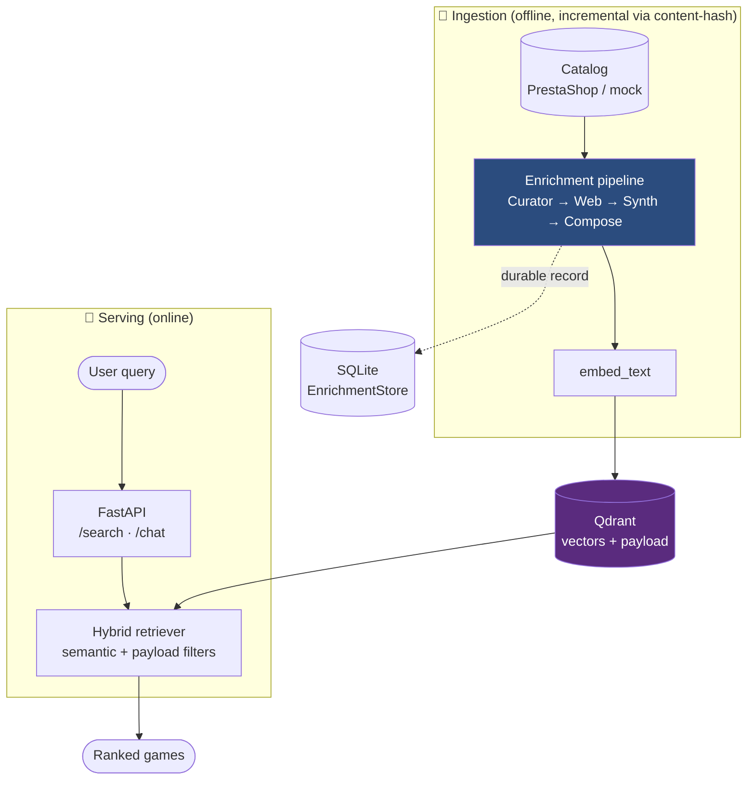

# Seller 🎲 — a RAG advisor that *sells* board games

[](https://github.com/msporchia/board-game-rag-seller/actions/workflows/ci.yml)

An AI salesclerk for a real Italian board-game catalog: it understands vague wishes
(*"something cooperative and medieval for two"*), asks the right few questions, and only ever
recommends **real, in-stock games** — never an invented title. A personal research project built
to do one thing properly — make semantic search over a messy product catalog actually *good* —
with **every claim measured** (LangChain · LangGraph · Qdrant · FastAPI · Ollama; local-first,
offline-runnable, provider-swappable). It is the AI brain of a three-repo storefront, consumed by
a [Node + TypeScript commerce BFF](https://github.com/msporchia/board-game-shop-api) and a
[React storefront](https://github.com/msporchia/board-game-shop-web).

> **Intentionally an applied R&D bench — not a single polished chatbot demo.** The goal is to
> compare RAG and agentic approaches on the same real, messy, commercial catalog and make the
> trade-offs visible: observable retrieval traces, reproducible eval runs, code-enforced
> grounding, documented regressions, preserved failure cases. The interesting part is not that
> one version "works" — it's what each approach costs, where it breaks, and how the damage is
> contained.

[](https://msporchia.github.io/board-game-rag-seller/demo/)

**[▶ Explore the interactive demo](https://msporchia.github.io/board-game-rag-seller/demo/)** —
replayable **real agent sessions over the live 501-game catalog**, not a handcrafted transcript:
each turn exposes the query the agent composed, the games it retrieved, the grounded
recommendation, the fallbacks — and the documented failures. Plus a real game's journey through
the enrichment pipeline, step by step. Sessions are recorded in-process; the demo regenerates
from them.

## The proof, in three numbers

| | Measured | Proof |
|---|---|---|
| A thin record made findable | rank **#45 → #1** of 50 — same embedder, same query, only the embedded text changes | [demo](https://msporchia.github.io/board-game-rag-seller/demo/) · [walkthrough](docs/showcase/terraforming-mars.md) |
| One measured day, frozen rulers | ranking quality (mean NDCG) **0.386 → 0.726**; conversational recall **0.545 → 0.818** | [experiments ledger](docs/experiments.md) |
| Invented recommendations | **structurally impossible** — grounding is enforced in code, not asked of the model | [ADR-0002](docs/adr/0002-grounding-enforced-in-code.md) |

*An R&D repo that hides its losses isn't one. The same rulers also recorded an honest regression
we kept visible (**#4 → #23**, [pinned by a red test](docs/showcase/viticulture.md)) and falsified
two comfortable hypotheses — one ledger row per change, each with its re-runnable command, in
[`docs/experiments.md`](docs/experiments.md).*

## The problem this answers

Board games are a *you-either-know-them-or-you-don't* category: most customers know Monopoly and
Risiko and quietly assume that's what's inside every box. A guide that explains "which genres
exist" moves nobody — nobody buys a category. What sells is a **salesperson**: one who asks the
right few questions, opens up possibilities the customer didn't know to ask for, and lands on a
**specific box on the shelf they can buy today**.

That conversation is what this project automates, in two parts.

---

## Part 1 — the retrieval engine

A real catalog is uneven: some games arrive richly described, many are a name and a few fields.
Fed raw to an embedder, that difference silently *becomes* the ranking — Terraforming Mars at
**#45** wasn't less relevant, it just had a thinner record. The principle: **no game is penalized
for its source**; the lever: **retrieval quality is decided by the text you embed**. A four-step
enrichment pipeline (Curator → Web → Synth → Compose) turns uneven records into dense, factual,
cited text before embedding — adding signal, never inventing — and the effect is measured
end-to-end on frozen corpora: **#45 → #1** on the thin record, a verbatim-quote gate that drops
plausible fabrications, and one honest regression kept visible (#4 → #23).



**Tech choices** (local-first; swap providers for prod — architecture unchanged):

| | Local (free, offline) | Production swap |
|---|---|---|
| Vector store | **Qdrant** (Docker) | same (managed) |
| Embeddings | `bge-m3` (Ollama; replaced `nomic-embed-text` on [measured evidence](docs/experiments.md)) | OpenAI `text-embedding-3` / managed |
| LLM | `llama3.1` 8B + `qwen2.5:7b` for the agent tier (Ollama) | a stronger model (Claude / GPT-4-class) |
| Orchestration | LangChain · LangGraph · FastAPI | same |

> 📖 **The full story — [`docs/retrieval-engine.md`](docs/retrieval-engine.md)**: the principle,
> the pipeline step by step, how it's measured, and every claim linked to the class that enforces
> it and the test that proves it.
>
> ⚡ **See it live:** [follow three real games through the pipeline in the interactive
> demo](https://msporchia.github.io/board-game-rag-seller/demo/) · [written
> walkthroughs](docs/showcase/README.md) with the exact fixtures.

---

## Part 2 — the conversational seller 💬

The salesperson on top of Part 1: each turn it reads the customer (enthusiasm, decisiveness,
expertise), routes a per-turn strategy in code — ask one clarifying question, explain a mechanic,
or propose concrete games *now* — and always lands on real boxes on the shelf. Two invariants are
enforced in code, never trusted to the model: an invented game id is **dropped with its sales
pitch**, and a failed turn degrades to an honest scripted reply, never a 500. Quick-reply taps
become **real search filters**; storefront bias (a Christmas push, a campaign) enters as **named
policy classes**, never a free prompt field. Behind one contract sit **three interchangeable
engines** — deterministic pipeline, code-piloted loop, tool-driving agent — measured head-to-head
as a quality/cost curve, not a leaderboard.


| engine | who drives the search | case pass | note |
|--------|-----------------------|:---------:|------|
| pipeline | deterministic code | 0.667 | re-baselined 2026-07-03 |
| piloted | code loop, model reformulates | 0.80 · −18% tok | June bench |
| agent · `qwen2.5:7b` | the model itself, via a tool | **0.733** | both cooperative cases pass |
| agent · **Claude Sonnet 5** | same engine, same bench, via responder harness | **1.000** (15/15) | the engine's measured ceiling |

The last row is the project's stance — *"if it works on the 8B, it flies on a stronger model"* —
turned into a measurement: every LLM role answered by **Claude Sonnet 5** through the
[file-exchange responder harness](tests/eval/ChatConversation/simulation/) — real model, real
engine, real retrieval, real oracle; the transport is a file exchange rather than an API call
(the API integration is a separate step, SEL-110). The harness exists so any stronger model can
be benchmarked on the same oracle *before* it is wired into production. All three
non-convergences disappear, zero turns without a tool call, fallback rate 0
([ledger](docs/experiments.md) row 14, caveats included: single run, a ceiling — not a local
config). **The local 7B is the bottleneck, not the engine.**

*(Single runs are samples, not verdicts — the same 15 cases scored 0.60/0.80/0.87 on identical
inputs; the noise is measured too.)*

> 📖 **The full story — [`docs/conversational-seller.md`](docs/conversational-seller.md)**: the
> grounding invariants, the strategy routing, the policy middleware, the three engines and their
> eval suites — every claim linked to its class and its test.
>
> ⚡ **Watch it sell:** [four unedited sessions on the live 501-game index in the interactive
> demo](https://msporchia.github.io/board-game-rag-seller/demo/) — every search the agent
> composed, the flaws annotated with their tickets · [written version](docs/showcase/live-session.md).

---

## Choose your path 🧭

You know best what you care about — every row is a self-contained entry point:

| You're interested in… | Start here | What you'll find |
|---|---|---|
| **Seeing it work, right now** | [▶ the interactive demo](https://msporchia.github.io/board-game-rag-seller/demo/) | real sessions replayed turn by turn · a game's journey through the pipeline |
| **RAG / representation engineering** | [the retrieval engine, in full](docs/retrieval-engine.md) → [enrichment/](docs/enrichment/README.md) | why the embedded text beats the embedder — claims linked to classes and tests |
| **Agents & tool-use** | [the conversational seller, in full](docs/conversational-seller.md) → [live sessions](docs/showcase/live-session.md) | a 7B driving its own search, every call recorded |
| **How to measure an LLM system** | [experiments ledger](docs/experiments.md) → [RESULTS.md](tests/eval/RESULTS.md) → [valutazione.md](docs/valutazione.md) | frozen rulers, before→after, rank-not-score |
| **Honest engineering (what does NOT work)** | [Viticulture, the kept regression](docs/showcase/viticulture.md) → [e2e-findings](docs/enrichment/e2e-findings.md) → [tickets/](docs/tickets/README.md) | measured failures, pinned by `xfail`, tracked |
| **The non-obvious decisions** | [ADRs](docs/adr/README.md) | the forks with a defensible alternative we rejected |
| **Running it yourself** | [Quickstart](#quickstart-self-contained-offline) ↓ | the full stack, offline, in 5 commands |

## Quickstart (self-contained, offline)

The stack runs without a real PrestaShop/MySQL: a bundled **mock** serves a synthetic demo
catalog over the same contract (point `MOCK_CATALOG` at your own JSON for a larger one — see
[`.env.example`](.env.example) and [`docs/pipeline-dati.md`](docs/pipeline-dati.md)).

```bash
# 1. Start the stack (Qdrant + Ollama + API + mock catalog)
docker compose up -d
#    (NVIDIA GPU optional: add -f docker-compose.gpu.yml — the LLM steps are slow on CPU)

# 2. Pull the models into Ollama (ONCE — the container starts empty)
docker exec seller-ollama ollama pull bge-m3       # embeddings (ingest/search)
docker exec seller-ollama ollama pull llama3.1     # LLM (enrichment/eval)
docker exec seller-ollama ollama pull qwen2.5:7b   # LLM for the agent chat tier (optional)

# 3. Ingest the demo catalog (runs the full Curator → Web → Synth → Compose pipeline)
docker compose exec seller-api python -m app.ingestion.ingester

# 4. Search
curl "http://localhost:8000/search?q=cooperativo+fantasy+per+due&k=5"

# 5. Chat (stateless; add "session_id" to the body for the stateful conversation)
curl -X POST http://localhost:8000/chat -H "Content-Type: application/json" \
     -d '{"message": "un gioco cooperativo per due, non troppo lungo"}'
```

**Verify:** Seller API → http://localhost:8000/health · Mock → http://localhost:8001/health ·
Qdrant → http://localhost:6333/dashboard · Ollama → http://localhost:11434

## Tests & eval

**What CI covers, precisely:** the badge above runs ruff and the deterministic offline unit
suite — the *contracts* ("certain data wins", grounding, fallback). The LLM evals and e2e runs
need local models (Ollama) and live services, so they stay out of CI **by design** and are
reproducible locally with the commands below; their latest measured output is committed in
[`tests/eval/RESULTS.md`](tests/eval/RESULTS.md) and the [ledger](docs/experiments.md).

```bash
docker compose exec seller-api python -m pytest tests/unit -q                # what CI runs: deterministic, offline
docker compose exec seller-api python -m pytest tests/eval/ChatPitch -q      # per-step quality, real LLM
docker compose exec seller-api python -m tests.eval_suite --suite core --k 5 --pipeline synth  # retrieval scorecard
docker exec seller-api python -m pytest tests/e2e/enrichment -v              # real end-to-end (LLM + web replay)
```

Observability (structlog + swappable LLM tracing) and what we're still blind to:
[`docs/observability.md`](docs/observability.md).

## Project structure

```
seller/
├── docker-compose.yml          # qdrant + ollama + api + mock catalog
├── mock/                       # mock PrestaShop "seller" endpoint (serves the DTO contract)
├── app/
│   ├── api/                    # FastAPI routers (/health, /search, /chat)
│   ├── chat/                   # advisor (grounded pitch) + LangGraph conversation + engines
│   ├── ingestion/enricher/     # the pipeline: curator · web · synth · compose
│   ├── core/                   # vector store · enrichment store · web search · logging · tracing
│   └── rag/                    # hybrid retriever + filters
├── docs/
│   ├── retrieval-engine.md     # Part 1, in full  ← the story behind the diagram above
│   ├── conversational-seller.md# Part 2, in full
│   ├── demo/                   # the interactive demo (GitHub Pages) + its recording scripts
│   ├── showcase/               # before → after walkthroughs on real games
│   ├── enrichment/             # one doc per pipeline step (the "why & how we know")
│   ├── adr/                    # architecture decision records
│   ├── tickets/                # the working backlog (one file per ticket)
│   └── experiments.md          # the measurement ledger — one row per change
└── tests/                      # unit (deterministic) · eval (real LLM, one suite per step) · e2e
```

## Decisions & backlog

The non-obvious forks — the ones with a defensible alternative we rejected — are short
[architecture decision records](docs/adr/README.md). What's open or planned lives in the
[ticket backlog](docs/tickets/README.md): one file per item, traced back to the design notes it
came from.
