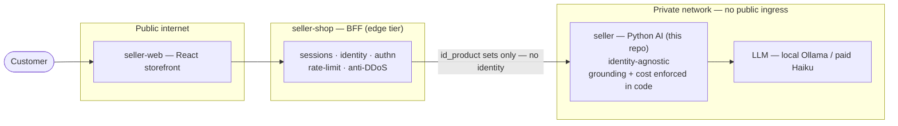

# 0005 — The seller is an internal, identity-agnostic service; defence is layered

**Status:** Accepted · recorded 2026-07-06 · **part post-hoc, part forward-looking.** The topology
and the identity split are already in the code; the edge gate, the cost ceiling and the network
isolation are decided-but-not-yet-built (tracked in SEL-148).

## Context

The seller is the Python AI microservice in a three-repo storefront: **seller-web** (React) →
**seller-shop** (Node BFF) → **seller** (this repo). Two questions decide the security/cost shape:
*who owns identity and abuse control*, and *what the seller must guarantee no matter who calls it*.

The realistic production model does not use the local LLM to sell — it is too weak — but a cheap
**paid** model (e.g. Haiku): little per call, not zero. So an unmetered path to the model is a
financial liability, and the AI tier can be *driven* by whoever reaches it.

## Decision

Keep the seller **internal and identity-agnostic**, and split the defence by *what each tier knows*.

- **The seller never learns who the customer is.** The BFF derives the commerce state server-side
  and passes only `id_product` sets (`received` / `cart` / `sent`); the seller matches them against
  retrieved hits with no identity, no mapping (`app/chat/models/customer_context.py`).
- **BFF = edge tier, owns identity and volume.** Because it holds sessions and authn, it is the
  right place for anti-spam / anti-DDoS rate limiting, differentiated **authenticated vs anonymous**
  and metered **per user / per session**. It sheds abusive volume cheaply.
- **Seller = backstop, owns the caller-independent guarantees.** The rules that must hold *whoever
  calls* live in the seller's code, not in a trusted caller: **grounding** (ADR-0002) and the
  **cost ceiling** (a daily hard-limit + per-session budget, SEL-148). The seller does not trust the
  BFF to have limited spend — only it knows the token/€ of each call.
- **Network isolation is the precondition.** The split only holds if the seller cannot be reached
  except through the BFF: a deployment control (private subnet / VPC, no public ingress), not code.

## Alternatives considered

- **Put identity, authn and rate-limiting in the seller.** Rejected: it duplicates what the BFF
  already has, couples the AI service to auth concerns, and fattens its trust surface. Caller-agnostic
  keeps the seller simple and testable.
- **Rely on the edge for cost too.** Rejected: only the seller knows per-call spend, and a bypassed
  or misconfigured edge must not mean an unbounded bill — the cost ceiling is a seller backstop
  (defence in depth), not a convenience for a well-behaved BFF.
- **Expose the seller directly, skip the BFF.** Rejected: no identity context at the AI tier and a
  paid-model-driving service on the public internet.

## Consequences

- **Clear ownership:** identity + volume at the edge, correctness + cost at the core. Each control
  sits where the context to enforce it exists.
- The seller's guarantees are **model- and caller-independent** — the same on the weak 8B, a strong
  local model, or paid Haiku (consistent with ADR-0002).
- **Honest gap:** the identity split is in the code today, but the cost ceiling, the edge gate, and
  the network isolation are **decided, not yet built** — tracked in SEL-148 (seller backstop here;
  edge gate + isolation specced and built from a `seller-shop` session, per the one-session-per-repo
  rule). This ADR records *where each control belongs and why*, not that it already runs.
- Commercial data never crosses into the seller's LLM context: margins live behind a hard API, and
  only a relative 1–5 priority per game would ever reach the model (SEL-122 P3), so an info leak at
  the AI tier is near-irrelevant.
