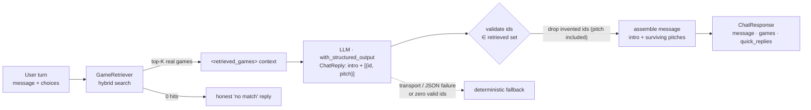
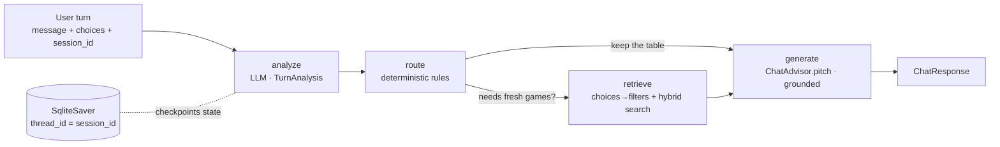

# Chat — the conversational advisor

> The "fun part": the bot that explores the catalog and proposes the right games. This file
> tracks the chat component the way `docs/enrichment/` tracks the ingest steps — what it does,
> how we measure it, what we found, what's next.

The chat is built in two stages, isolated on purpose (same per-step discipline as the rest of
the project — a single end-to-end blob averages away who gains and who loses):

- **Phase 4 — RAG generation (stateless).** One user turn → hybrid retrieval → a grounded
  Italian "salesperson" pitch over the retrieved games, in the structured
  `{message, games, quick_replies}` contract. Reachable with a plain `POST /chat`.
- **Phase 5 — Conversation (stateful).** A small LangGraph wrapping the same retrieve→pitch core
  with session memory (checkpointer keyed by `session_id`), deterministic strategy routing
  (GUIDED / EXPLANATORY / DISCOVERY / QUICK MATCH), quick-reply clicks parsed into real filters,
  and the model-tiering escalation contract. Opt-in: send a `session_id`; without it the request
  takes the Phase 4 path unchanged. Spec'd in `docs/note.md`, `docs/idee.md §L`.

Why split them: Phase 4 isolates the two riskiest, most measurable properties — *grounding*
(never recommend a game that isn't in the catalog) and *robust structured output* — before the
conversational complexity of Phase 5 is layered on top. Exactly the reason synthesis was moved
out of the Curator: one task at a time, the local 8B holds up better and we can measure each.

## Architecture (Phase 4)

- Endpoint: `POST /chat` (`app/api/chat.py`) — body `{message, choices[], k, session_id?}`
  (no `session_id` → this stateless path).
- Core: `ChatAdvisor` (`app/chat/advisor.py`). Schemas: `app/chat/models.py`.
- LLM: `llama3.1` (local, Ollama) for now — see *low-hanging fruit*.

### Two invariants, both enforced in code (we do not trust the model)

1. **Anti-hallucination grounding.** The LLM references games by `id` only; any id it returns
   that was not in the retrieved set is dropped before the response is built — together with the
   pitch bound to it. It can never surface a title outside the catalog (the absolute rule from
   `docs/note.md`). Same discipline as the Curator's verbatim-quote validation — the model
   proposes, the code verifies.
2. **Robust transport.** `with_structured_output(ChatReply)` constrains the JSON shape
   (`idee.md §A`); if the 8B still fails — or none of its picked ids survives validation — the
   advisor falls back to a deterministic reply over the top hits rather than returning a 500.
   Empty retrieval short-circuits to an honest "no match" without prompting the LLM at all.

## Findings — first real runs (llama3.1, 10-game dev index)

Query: *"un gioco cooperativo per due, non troppo lungo"*. Two runs, before/after a prompt fix.

| | Run 1 | Run 2 (prompt fix) |
|---|---|---|
| Message names | Pandemic, Azul, Dixit | Azul, Pandemic, Ticket to Ride |
| Cards (`games`) | Catan, Dixit, Azul | Catan, Dixit, Azul |
| Internal `id=` leaked into prose | yes ❌ | no ✅ |
| `quick_replies` filled | no | no |
| Latency | ~49 s | ~50–130 s (host-load dependent) |

What we learned:

- ✅ **Grounding holds.** Every id that reached the cards was in the retrieved set — no invented
  title leaked through. The critical invariant works.
- ✅ **Id leak fixed.** Telling the model to name games (never the internal id) in the prose
  removed `"(id=4)"` from the customer-facing text.
- ❌ **Prose ↔ cards incoherence persists.** The 8B writes the pitch about one set of games and
  returns a *different* set in `recommended_ids` — so the rendered cards don't match the text.
  An explicit "keep them consistent" instruction did **not** fix it. This is a model-capability
  limit (keeping two free-form fields in sync), not a prompt bug. *Since addressed structurally —
  see "Coherence by construction" below; to be re-measured.*
- ❌ **`quick_replies` come back empty** despite being requested.

These are expected weaknesses of an 8B on structured output (`idee.md §A`) and the reason the
project's stance is *"if it works on the 8B it flies on a stronger model"*. They are logged below,
not papered over.

## Coherence by construction (implemented)

The incoherence finding above was not fixable by instructions, so the *shape* was changed
instead: `ChatReply` is no longer `{message, recommended_ids, quick_replies}` but
`{intro, recommendations: [{id, pitch}], quick_replies}`. Each pitch is bound to its game id
locally — much easier for an 8B than keeping a prose blob and a separate id list in sync. The
customer `message` is then **assembled in code**: `intro` + the pitch of each recommendation
whose id survived grounding validation (LLM order preserved, invented ids dropped silently —
pitch included). The text can therefore only ever describe games that are in the cards;
incoherence is structurally impossible, not requested. Still one LLM call, same external
`{message, games, quick_replies}` contract. Degradation when *no* id survives validation:
nothing grounded was pitched, so the advisor reuses the deterministic fallback over the top
hits — message and cards still match. The `intro` is asked to stay name-free so a dropped
recommendation can't leak through it. Whether the 8B fills the new shape *well* (pitch quality,
quick_replies) is an open question — the finding needs re-measuring against the real llama3.1
on the next run.

First smoke runs (llama3.1 CPU, two stateful Phase 5 turns): the *mechanics* held — graph,
session memory, traces, no 500s — but the LLM produced zero valid recommendations on both
turns, so the deterministic fallback fired each time (the `traces` table shows both calls
succeeding with ~50 output tokens: the model answers, the ids don't survive validation).
The structural guarantee did its job — message and cards stayed coherent — but pitch quality
on the 8B is now the bottleneck; see fruit #2 (stronger model).

## Low-hanging fruit (next levers, measure to decide)

1. ~~**Coherence by construction (recommended first).**~~ ✅ **Implemented** — see the section
   above. Re-measure on the real 8B.
2. **Stronger / remote model.** `with_structured_output` quality is the bottleneck. Try
   Qwen2.5-7B/14B or Gemma-9B locally, or go remote (Haiku) via a provider-swappable transport
   (`idee.md §E`, litellm). Expected to fix the empty `quick_replies` and lift pitch quality
   (coherence is now enforced structurally, see above).
3. **Richer pitch context.** The retriever's `GameHit` payload is lean (no description). Pull the
   synthesized description from the EnrichmentStore / payload so the pitch has more to sell with.
4. **Live price & stock.** The contract wants these fetched live from PrestaShop at recommendation
   time (`seller.md §4`); stubbed for now until the privileged endpoint exists.
5. ~~**Quick-reply clicks → filters.**~~ Done in Phase 5: with a `session_id`, `choices` are
   parsed into real `SearchFilters` merged into the session (see below). The stateless path
   keeps the Phase 4 fold-into-query behavior.

## Architecture (Phase 5) — the stateful conversation

A deliberately small `StateGraph` (`app/chat/graph.py`) around the Phase 4 core. The advisor's
grounding validation, deterministic fallback, message assembly and prompt assembly stay in ONE
place (`ChatAdvisor.pitch`); the graph adds what a single stateless turn cannot have: memory, a
read of the user, and a strategy.

- **analyze** — one structured-output LLM call per turn (`TurnAnalysis`): the user-analysis
  dimensions from `docs/note.md` (enthusiasm low/medium/high, decisiveness, expertise_level
  beginner/intermediate/advanced, reply style) plus the escalation contract (below). If the
  analyzer fails, the previous turn's analysis is kept — the analysis can degrade, the turn
  cannot 500.
- **route** — the strategy transition rules as deterministic code (no second LLM call: the
  model *reads* the user, the code *decides*). The conditional edge then asks one question:
  does this turn need fresh games? Proposal strategies (QUICK MATCH, DISCOVERY), any turn with
  new clicks, or an empty table → retrieve; a GUIDED/EXPLANATORY follow-up keeps talking over
  the games already shown instead of reshuffling the cards under the customer mid-guidance.
- **retrieve** — clicks become filters (below), merged into the session; query = current
  message + the last couple of user turns (so a forced QUICK MATCH searches with everything
  collected). The strategy decides how many games go on the table (GUIDED 2 … QUICK MATCH 4).
- **generate** — delegates to `ChatAdvisor.pitch`: the same grounded coherence-by-construction
  path as Phase 4, with the fixed+dynamic prompt structure from `docs/note.md` (fixed part: how
  to talk at the inferred expertise level; dynamic part: this turn's strategy). The two Phase 4
  invariants apply untouched — id validation against the retrieved set, in-code message
  assembly and the deterministic fallback are the exact same code on both paths.

### Session state (what the checkpointer persists per `session_id`)

| field | what / why |
|---|---|
| `history` | rolling window of `utente:`/`bot:` lines (last ~6 exchanges) |
| `filters_spec` | accumulated `SearchFilters` spec; per-field merge — latest click on a dimension wins |
| `enthusiasm`, `decisiveness`, `expertise_level`, `reply_style` | the analyze read of the user |
| `escalate`, `escalation_reason`, `confidence` | the escalation contract, re-proposed each turn |
| `strategy`, `turns_without_proposal` | current strategy + the stall counter behind the forced rule |
| `hits`, `last_recommended_ids` | the games currently "on the table" / featured last |

Memory is a property of the graph runtime (LangGraph checkpointer, `thread_id` = `session_id`),
not hand-rolled session code: the API handler stays stateless. Storage is `SqliteSaver` on
`data/chat_sessions.db`, next to the enrichment DB — same local-first discipline; swapping to
`PostgresSaver`/`RedisSaver` in production is a constructor change, no node/state/API change.

### Routing rules (from `docs/note.md`, first match wins)

| condition | strategy |
|---|---|
| ≥ 3 exchanges without a concrete proposal | **QUICK MATCH** (forced) + fresh retrieval |
| user is decided | **QUICK MATCH** |
| enthusiasm high | **DISCOVERY** (EXPLANATORY if beginner) |
| enthusiasm low / short replies | **GUIDED** (QUICK MATCH if already somewhat decided) |
| default (undecided middle ground) | **GUIDED** |

"Concrete proposal" = a QUICK MATCH or DISCOVERY turn (fresh retrieval, multi-game pitch);
GUIDED/EXPLANATORY turns guide and explain, so they feed the stall counter.

### Clicks → filters ("a click becomes a new filter")

The pitch prompt instructs the model to emit quick replies in machine-parseable shapes —
`"per N giocatori"`, `"max N minuti"`, `"dai N anni"`, `"senza espansioni"`, `"complessità
bassa/media/alta"` — so the parser (`app/chat/choices.py`) is plain regex, no LLM: we control
both ends. A parsed click becomes a `SearchFilters` fragment merged into the session (clicking
"per 4 giocatori" later *replaces* "per 2 giocatori"); anything unparsed (e.g. "Sorprendimi")
falls back into the query string, Phase 4 style — degraded, never dropped.

### Model tiering — the escalation contract only

`TurnAnalysis` carries `escalate` / `escalation_reason` / `confidence` (the confidence-based
scheme from `docs/note.md`). When the analyzer sets `escalate=true`, the generate step runs on
`LLM_MODEL_STRONG` instead of `LLM_MODEL`. The default is empty → same model, so locally the
mechanism is exercised end-to-end as a no-op; pointing the setting at a stronger model (bigger
local model, or a remote one behind a provider-swappable transport) is a config change. What we
demonstrate is the *contract*, measured by tests — not a paid API integration.

### Deliberately NOT done (yet)

- **Real paid-model tiering.** The Haiku→Sonnet split from `docs/note.md` needs the remote
  transport (`idee.md §E`); only the switch mechanism exists today.
- **Long-term user profiles.** The cross-session user-profile JSON in `docs/note.md`
  (loves/hates, past games, skill memory) is future work — memory today lives and dies with the
  `session_id`.
- **Conversation quality measurements.** The graph's *mechanics* are unit-tested; how well the
  8B actually reads enthusiasm or holds a strategy is a measured property of the real model, to
  be tracked here once there are real multi-turn runs (same discipline as the Phase 4 findings).

## Tests

`tests/unit/ChatAdvisor/` — offline, deterministic (fake retriever + fake structured LLM):
grounding (an invented id is dropped from both cards and message, LLM order preserved), message
assembly (intro + surviving pitches), honest empty-retrieval path (no LLM call), fallback on
transport failure and on all-ids-invalid, contract shape (`quick_replies` capped, `choices`
reach retrieval). The model's *quality* (coherence, pitch) is not unit-tested —
that's a measured property of the real LLM, tracked in the findings above.

`tests/unit/ChatGraph/` — offline, deterministic (fake analyzer/pitch/strong LLMs + fake
retriever, in-memory checkpointer): every routing rule including the forced QUICK MATCH (and
that the forced turn re-retrieves), clicks→`SearchFilters` parsing (valid against the real
filter registry) and the leftover path, state persistence across turns of one session vs.
isolation across sessions, the escalation flag switching the generate model, and the
`session_id`-absent path bypassing the graph entirely (backward compatibility).
