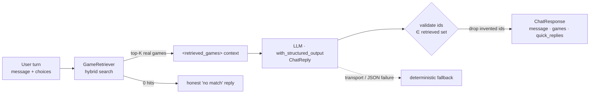

# Chat — the conversational advisor

> The "fun part": the bot that explores the catalog and proposes the right games. This file
> tracks the chat component the way `docs/enrichment/` tracks the ingest steps — what it does,
> how we measure it, what we found, what's next.

The chat is built in two stages, isolated on purpose (same per-step discipline as the rest of
the project — a single end-to-end blob averages away who gains and who loses):

- **Phase 4 — RAG generation (stateless).** One user turn → hybrid retrieval → a grounded
  Italian "salesperson" pitch over the retrieved games, in the structured
  `{message, games, quick_replies}` contract. **This is the current cut.**
- **Phase 5 — Conversation (stateful).** A LangGraph wrapping the same retrieve→pitch core with
  session memory, strategy routing (GUIDED / EXPLANATORY / DISCOVERY / QUICK MATCH), quick-reply
  clicks turned into filters, and Haiku→Sonnet model tiering. See `docs/note.md`, `docs/idee.md §L`.

Why split them: Phase 4 isolates the two riskiest, most measurable properties — *grounding*
(never recommend a game that isn't in the catalog) and *robust structured output* — before the
conversational complexity of Phase 5 is layered on top. Exactly the reason synthesis was moved
out of the Curator: one task at a time, the local 8B holds up better and we can measure each.

## Architecture (Phase 4)

- Endpoint: `POST /chat` (`app/api/chat.py`) — body `{message, choices[], k}`.
- Core: `ChatAdvisor` (`app/chat/advisor.py`). Schemas: `app/chat/models.py`.
- LLM: `llama3.1` (local, Ollama) for now — see *low-hanging fruit*.

### Two invariants, both enforced in code (we do not trust the model)

1. **Anti-hallucination grounding.** The LLM references games by `id` only; any id it returns
   that was not in the retrieved set is dropped before the response is built. It can never
   surface a title outside the catalog (the absolute rule from `docs/note.md`). Same discipline
   as the Curator's verbatim-quote validation — the model proposes, the code verifies.
2. **Robust transport.** `with_structured_output(ChatReply)` constrains the JSON shape
   (`idee.md §A`); if the 8B still fails, the advisor falls back to a deterministic reply over
   the top hits rather than returning a 500. Empty retrieval short-circuits to an honest
   "no match" without prompting the LLM at all.

## Findings — first real runs (llama3.1, 10-game dev index)

Query: *"un gioco cooperativo per due, non troppo lungo"*. Two runs, before/after a prompt fix.

| | Run 1 | Run 2 (prompt fix) |
|---|---|---|
| Message names | Pandemic, Azul, Dixit | Azul, Pandemic, Ticket to Ride |
| Cards (`games`) | Catan, Dixit, Azul | Catan, Dixit, Azul |
| Internal `id=` leaked into prose | yes ❌ | no ✅ |
| `quick_replies` filled | no | no |
| Latency | ~49 s | ~50–130 s (host-load dependent) |

What we learned:

- ✅ **Grounding holds.** Every id that reached the cards was in the retrieved set — no invented
  title leaked through. The critical invariant works.
- ✅ **Id leak fixed.** Telling the model to name games (never the internal id) in the prose
  removed `"(id=4)"` from the customer-facing text.
- ❌ **Prose ↔ cards incoherence persists.** The 8B writes the pitch about one set of games and
  returns a *different* set in `recommended_ids` — so the rendered cards don't match the text.
  An explicit "keep them consistent" instruction did **not** fix it. This is a model-capability
  limit (keeping two free-form fields in sync), not a prompt bug.
- ❌ **`quick_replies` come back empty** despite being requested.

These are expected weaknesses of an 8B on structured output (`idee.md §A`) and the reason the
project's stance is *"if it works on the 8B it flies on a stronger model"*. They are logged below,
not papered over.

## Low-hanging fruit (next levers, measure to decide)

1. **Coherence by construction (recommended first).** Replace "prose + a separate id list" with a
   per-game-bound shape: `ChatReply { intro, recommendations: [{id, pitch}], quick_replies }`.
   The customer `message` is then assembled from `intro` + the `pitch` of each *validated* id, so
   the text can only ever describe games that are in the cards. Still one LLM call; binds the
   reason to the id locally (much easier for the 8B than syncing two lists). Directly kills the
   incoherence finding.
2. **Stronger / remote model.** `with_structured_output` quality is the bottleneck. Try
   Qwen2.5-7B/14B or Gemma-9B locally, or go remote (Haiku) via a provider-swappable transport
   (`idee.md §E`, litellm). Expected to fix both the coherence and the empty `quick_replies`.
3. **Richer pitch context.** The retriever's `GameHit` payload is lean (no description). Pull the
   synthesized description from the EnrichmentStore / payload so the pitch has more to sell with.
4. **Live price & stock.** The contract wants these fetched live from PrestaShop at recommendation
   time (`seller.md §4`); stubbed for now until the privileged endpoint exists.
5. **Quick-reply clicks → filters.** Phase 4 folds `choices` into the retrieval query string;
   Phase 5 parses them into real `SearchFilters` (the "a click becomes a new filter" design).

## Tests

`tests/unit/ChatAdvisor/` — offline, deterministic (fake retriever + fake structured LLM):
grounding (invalid/invented ids dropped, LLM order preserved), honest empty-retrieval path (no
LLM call), fallback on transport failure, contract shape (message pass-through, `quick_replies`
capped, `choices` reach retrieval). The model's *quality* (coherence, pitch) is not unit-tested —
that's a measured property of the real LLM, tracked in the findings above.
