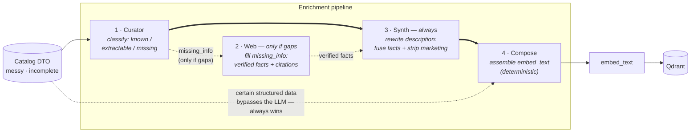
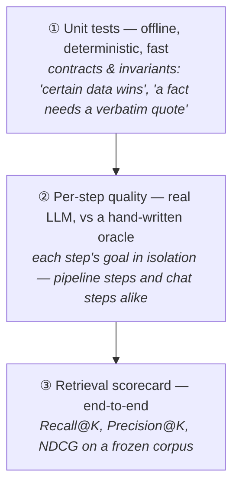

# Part 1 — the retrieval engine, in full

> The summary and the architecture diagram live in the [README](../README.md#part-1--the-retrieval-engine).
> This page is the full story: the principle, the pipeline step by step, how it's measured, and
> every claim with the class that enforces it and the test that proves it.
>
> ⚡ **Prefer to see it?** [Follow three real games through the pipeline, step by step, in the
> interactive demo](https://msporchia.github.io/board-game-rag-seller/demo/).

## The principle this project is built on

A real catalog is **heterogeneous and incomplete**: records arrive from different sources with
wildly different quality — some games richly described, many just a name and a few fields. Fed
raw to an embedder, that difference silently *becomes* the ranking: well-documented games
surface, thin ones disappear. Terraforming Mars at **#45** wasn't less relevant — it just had a
thinner record. That's not a ranking; it's a data-entry accident.

> **Every game must be equally findable and equally sellable, whatever the quality of its
> source data.** The system must never penalize a game for where its record came from. If one
> game is to outrank another, it must be **intentional** — margin, recent sales, a promotion —
> applied as an explicit layer, never inherited from data quality.

The lever that makes the principle enforceable:

> **Retrieval quality is decided by the text you embed — not only by the embedding model.**

An embedding is a *lossy semantic centroid* of its input (see [`valutazione.md`](valutazione.md)).
Feed it three paragraphs of marketing (*"epic legendary adventure!"*) and the centroid lands on
"vague epic", so a search for *"cooperative dungeon crawler"* can't tell the right game from the
wrong one. The embedder is fixed and query-agnostic; the **text** is the lever we control.
**Enrichment is the equalizer**: it turns the uneven input into *uniform, dense, factual,
search-friendly* records before embedding — adding signal, never inventing — so the retriever
ranks the *games*, not their data entry. (No intentional boost layer exists yet; today the
ranking is pure relevance, by design.) This is **representation engineering**, and everything
below is it, measured.

> #### 🇮🇹 Why the data, prompts and queries are in Italian
> The **code and docs are in English**; the **catalog text, LLM prompts and embedded/queried
> strings are Italian — on purpose.** This targets a real Italian board-game shop: the inputs are
> genuine Italian marketing DTOs and the web fixtures are **real Italian review pages**, scraped
> and frozen as-is. Translating them, or hand-crafting tidy English toy data, would quietly defeat
> the experiment — you'd be proving a *tailored* example works, not that the mechanism survives the
> messy, redundant, real-world prose it's actually built to handle. The realism **is** the test.

## The enrichment pipeline

One record per game flows through four steps. The golden rule throughout: **certain data always
wins** — if the catalog states the player count, no LLM guess can override it.

| # | Step | What it does | Doc · code |
|---|------|--------------|------------|
| 1 | **Curator** | an LLM pass that classifies every fact as *known / extractable / missing* — **no invention**; every extraction backed by a verbatim quote | [01-curator](enrichment/01-curator.md) · [`CuratorEnricher`](../app/ingestion/enricher/curator.py) |
| 2 | **Web** | **fallback — fires only when the Curator left gaps** (`missing_info`): searches trusted reviews and extracts verified facts, **each with a citation** checked against the page | [02-web](enrichment/02-web.md) · [`WebEnricher`](../app/ingestion/enricher/web.py) |
| 3 | **Synth** | **runs on every game** (not gated on gaps): rewrites the description to *(a)* fuse the recovered facts in so they reach `embed_text` — *the link that closed the loop* — and *(b)* strip marketing noise while keeping the theme/setting/mechanic words | [03-synth](enrichment/03-synth.md) · [`SynthEnricher`](../app/ingestion/enricher/synth.py) |
| 4 | **Compose** | deterministically assembles the `enriched` fields into the final `embed_text` — the **baseline to beat** | [04-compose](enrichment/04-compose.md) · [`RuleComposeEnricher`](../app/ingestion/enricher/compose.py) |

→ Full rationale, data model, and per-step metrics: [`enrichment/`](enrichment/README.md).

## We decide with numbers, not vibes

Three evaluation levels, each with a distinct job — so a gain in one step can't hide a loss in
another:

Two principles run through all of it:

- **The oracle is never fed to the system** — it's the answer key, not an input.
- **We rank, we don't score.** Cosine similarity is uncalibrated (perfect vs wrong can be ~0.06
  apart), so "70%" means nothing; what matters is the *right games ranking above the wrong ones*
  ([ADR-0004](adr/0004-rank-not-score.md)).

And when the numbers say we **lost**, we write it down. Every lever moved on the same frozen
rulers, one row per change with its re-runnable command:
[`experiments.md`](experiments.md).

## The results, on real games 🔍

Three real catalog games, carried end-to-end through the pipeline and ranked by the **real
retriever** on a frozen 50-game corpus. Same embedding model, same queries — only the embedded
text changes:

| | Game | What it demonstrates | Before → after |
|---|------|----------------------|----------------|
| 🚀 | [**Terraforming Mars**](showcase/terraforming-mars.md) | the recovery: a thin entry made findable | rank **#45 → #1** of 50 |
| 🔬 | [**Onitama**](showcase/onitama.md) | the guarantee: recovery you can *trust* | fabrication → discarded |
| ⚖️ | [**Viticulture**](showcase/viticulture.md) | the honest loss, kept visible | rank **#4 → #23** |

What happens to each game, in plain words:

- **Terraforming Mars** arrives with *no description* — to the embedder it's a spec sheet, and
  the query *"gioco di fantascienza per terraformare marte"* ranks it **#45**. The Curator flags
  what's missing; the Web step recovers the missing facts from trusted reviews (*marte, ossigeno,
  oceani* — each backed by a quoted source); the Synth step weaves them into clean prose. Same
  game, same embedder, same query: **#1**.
- **Onitama** has plenty of prose, but it's marketing (*"la magia… un viaggio nel cuore delle
  arti marziali"*) and never says *what kind of game it is*. The Web step fills exactly that
  gap — and keeps **only facts whose quote is literally present in the source page**; a model
  guess with no quote (*"adatto alle famiglie"* — plausible, unsourced) is thrown away, not
  embedded.
- **Viticulture** was already rich — and the pipeline made it **worse**. Synth compressed
  ~2300 chars to ~1200 and dropped *vino / toscana* signal, so a common query slipped off the
  first screen (#4 → #23). We kept the failure: it's documented in
  [`e2e-findings.md`](enrichment/e2e-findings.md) and pinned by an `xfail` test that turns green
  only when it's fixed. A showcase that only shows wins is a sales brochure.

Each walkthrough shows the exact DTO in, the real computed baseline `embed_text`, the
verbatim-cited facts the pipeline adds, and the measured rank delta → [start here](showcase/README.md).

## No claim without a class and a test

| The claim | The class that enforces it | The proof |
|---|---|---|
| "Certain data always wins" | [`CuratorEnricher`](../app/ingestion/enricher/curator.py) · [`RuleComposeEnricher`](../app/ingestion/enricher/compose.py) | [tests/unit/CuratorEnricher](../tests/unit/CuratorEnricher/) · [RuleComposeEnricher](../tests/unit/RuleComposeEnricher/) |
| "A fact needs a verbatim quote, or it's discarded" | [`WebEnricher`](../app/ingestion/enricher/web.py) | [tests/unit/WebEnricher](../tests/unit/WebEnricher/) · [e2e with real frozen pages](../tests/e2e/enrichment/) |
| "The Synth regression stays red until it's actually fixed" | [`SynthEnricher`](../app/ingestion/enricher/synth.py) | [`xfail` pin](../tests/e2e/enrichment/test_phase3_retrieval.py) |
| "Ingestion is incremental" (unchanged games are skipped) | [`EnrichmentPipeline`](../app/ingestion/enricher/pipeline.py) · [`EnrichmentStore`](../app/core/enrichment_store.py) | [tests/unit/EnrichmentPipeline](../tests/unit/EnrichmentPipeline/) · [EnrichmentStore](../tests/unit/EnrichmentStore/) |
