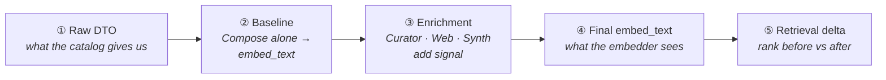

# Showcase — one game's journey through the pipeline

> The [enrichment pipeline](../enrichment/README.md) explains *how* each step works.
> This folder shows *what it does to a real game* — the same record **before** and **after**
> the pipeline, with the measured effect on retrieval.

The whole project rests on one principle and the claim that makes it enforceable:

> **Principle — no game is penalized for its source.** Records arrive with wildly different
> quality; every game must be equally findable and equally sellable. Any deliberate ranking
> (margin, sales history, a promotion) belongs in an explicit layer — it must never be an
> accident of data entry.

> **Claim — retrieval quality is decided by the text we embed**, not only by the embedding
> model. Shape the text well and a cheap embedder finds the right game; feed it raw marketing
> and even a great embedder can't. Enrichment is the equalizer.

These three walkthroughs are the proof. Each takes a **real catalog game**, runs it through
`Curator → Web → Synth → Compose`, and reports the **rank the real retriever** gives it on
real user-style queries — measured end-to-end on a frozen 50-game corpus with the same
distractors, in two indexes identical except for the target game's text.

| Walkthrough | What it shows | Headline |
|-------------|---------------|----------|
| 🚀 [**Terraforming Mars**](terraforming-mars.md) | enrichment **recovers** a thin catalog entry | rank **#45 → #1** after the Web step fills the gaps |
| 🔬 [**Onitama**](onitama.md) | the **anti-hallucination** discipline: every recovered fact carries a verbatim quote | a gap filled *with evidence*, fabrications dropped |
| ⚖️ [**Viticulture**](viticulture.md) | an **honest regression** we measured and didn't hide | full pipeline ranks **worse** than the baseline — and the open test that tracks it |

The conversational layer will get the same treatment — one customer's session, before → after,
enforced vs generated: [**Chat**](chat.md) (🚧 structure staged, awaiting a real recorded session).

## How to read each file

Every walkthrough follows the same five beats:

- **① and ②** are *exact*: the DTO is copied from the corpus, and the baseline `embed_text` is
  produced by running the real deterministic `RuleComposeEnricher` on it (no LLM, reproducible).
- **③** mixes *exact* evidence (the Web facts are verbatim quotes from the recorded source pages)
  with one *representative* element (the Synth prose — an LLM step, so the wording varies between
  runs; the example shows the shape, not a frozen string).
- **⑤** is *measured*: the ranks come from [`e2e-findings.md`](../enrichment/e2e-findings.md),
  produced by the real `GameRetriever` over the frozen corpus.

Where something is illustrative rather than a literal frozen output, it is labelled inline.
That distinction — *measured vs representative* — is itself part of the point.

> 🇮🇹 **The game texts, quotes and queries below are in Italian by design** — they're real DTOs
> from an Italian catalog and real Italian review pages, not data translated or tailored for the
> demo. See the [README note](../../README.md#-why-the-data-prompts-and-queries-are-in-italian)
> for why that realism is the whole point.
