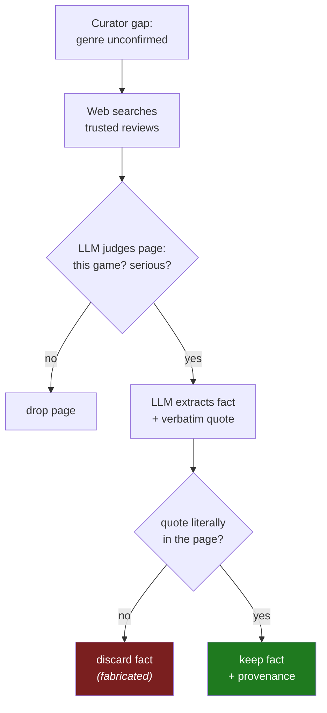
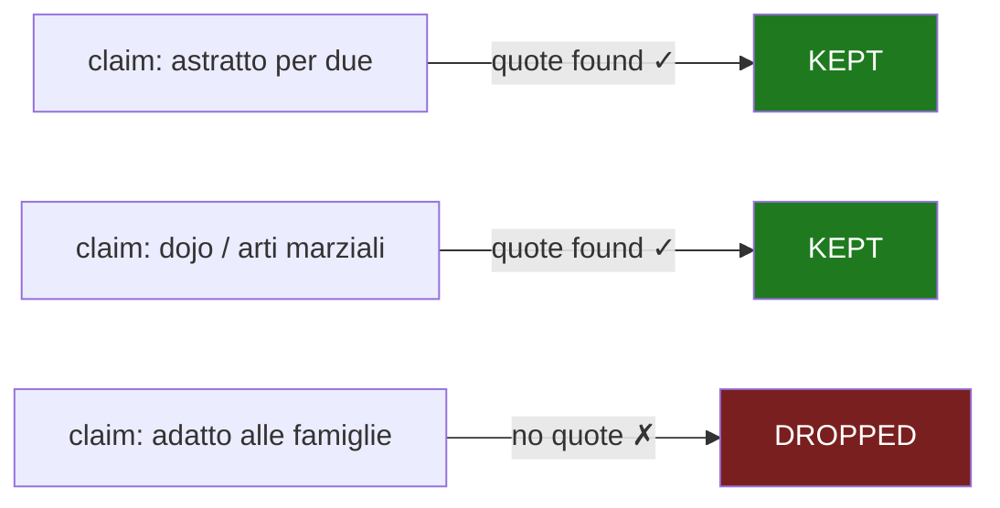

# 🔬 Onitama — recovery you can *trust*

> **Headline:** the Web step recovered the gap "what genre is this?" → **abstract / dojo duel** —
> but only after each fact passed a **verbatim-quote check**. A model guess with no quote in the
> source is **thrown away**, not embedded. Recovery is worthless if it pollutes the catalog.

[Terraforming Mars](terraforming-mars.md) showed enrichment *recovering* facts. Onitama shows
the rule that makes that recovery safe: **never invent**. Every fact the pipeline adds is
traceable to a real sentence in a real source.



---

## ① The raw input — already decent, but with a blind spot

Onitama's catalog record is *not* thin — it has a full marketing description and good tags:

```jsonc
{
  "name": "Onitama - Gioco Strategico di Arti Marziali per 2 Giocatori, ...",
  "tags": ["Astratto", "Gestione della Mano", "Oriente"],
  "players": [2], "duration_min": 10, "complexity": "Medio-Leggero (2)",
  "description": "Scopri la Magia di Onitama … un viaggio nel cuore delle arti marziali
                  giapponesi … Preparati a dominare il santuario di Onitama …"
  // ↑ lots of evocative prose: "arti marziali", "giapponesi", "santuario"
}
```

The prose sells *atmosphere* but is vague on **what kind of game it is**. The genre slot is the
one the Curator can't confirm from the text — so it goes to `missing_info` and the Web step
fires (verified in [`FINDINGS.md`](../../tests/e2e/enrichment/FINDINGS.md) §3: Onitama → Web
fires; a rich game like Viticulture → it doesn't).

## ② Baseline — the marketing centroid

The deterministic `RuleComposeEnricher` produces a long `embed_text` (2271 chars). The problem
isn't length — it's that the dominant signal is *"epic martial-arts adventure"* marketing, while
the concrete identity (**a perfect-information abstract**, a **duel of dojos** decided by
swapped move-cards) is thin. A user searching *"gioco da tavolo astratto per due giocatori"*
relies on the single tag word "Astratto" surviving a wall of prose about *santuari* and *brividi
della vittoria*.

## ③ Enrichment — the gap filled, with citations

The Web step pulls the genre/identity from real reviews. These are the **actual recorded
quotes** ([`fixtures/onitama.json`](../../tests/e2e/enrichment/fixtures/onitama.json)), each
verified verbatim in its page before being accepted:

| Recovered fact | Verbatim quote (verified in page) | Source |
|----------------|-----------------------------------|--------|
| genre = **astratto per due** | *"È un gioco da tavolo astratto per due giocatori, della durata di 15-20 minuti, vagamente ambientato in oriente"* | goblins.net |
| theme = **duel of dojos** | *"Onitama è una lotta tra due dojo di arti marziali"* | goblins.net |
| mechanic = **swapped move-cards** | *"Ogni mossa che utilizzerete arriverà quindi a disposizione dell'avversario con un turno di ritardo"* | giochisulnostrotavolo.it |

The discipline is the point. Consider the kind of claim a small LLM is tempted to make:

> ❌ *"adatto alle famiglie"* — plausible, but **no source states it** → no quote → **discarded**.
> The slot stays honest instead of being filled with a guess.



This is the **same rule** the Curator applies to its own text extractions — *precision over
recall, a wrong fact is worse than a gap* — applied again to the open web, the noisiest source
of all. (See [Web step](../enrichment/02-web.md) for the full retrieve-judge-verify chain.)

## ④ The final embed_text

The Synth step weaves the *verified* facts into the description; Compose assembles it.
*Representative* Synth output (LLM wording varies):

```
Astratto a informazione perfetta per due giocatori, ambientato in oriente: una sfida tra due
dojo di arti marziali su una scacchiera 5×5. Le mosse sono dettate da carte che, dopo l'uso,
passano all'avversario — un duello elegante e tattico.
```

Now the embedded text says, in plain words, **what the game is** — `astratto`, `due`, `dojo`,
`arti marziali`, `mosse` — the exact tokens of the queries the oracle expects this game to win:
*"gioco da tavolo astratto per due giocatori"*, *"gioco di arti marziali per due"*.

## ⑤ Why this matters more than a rank number

Onitama starts from a decent record, so its retrieval gain is real but undramatic — and that's
the honest framing. Its job in this showcase isn't a big number; it's to demonstrate the
**guarantee** behind every number elsewhere: when [Terraforming Mars jumps #45 → #1](terraforming-mars.md),
you can trust it isn't because the pipeline made things up. Every recovered fact has a citation.

→ Next: [Viticulture](viticulture.md) — where the pipeline makes things *worse*, and we say so.
