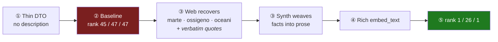

# 🚀 Terraforming Mars — recovering a thin catalog entry

> **Headline:** a game with a stripped-down catalog record is **almost invisible** to search
> (rank **#45 / #47 / #47** out of 50). After the pipeline recovers the missing facts from the
> web, the same game returns to the **first screen**: **#1 / #26 / #1**.

This is the value of enrichment in production, where many products have **thin descriptions**.
Source: [`e2e-findings.md`](../enrichment/e2e-findings.md) §2,
measured by the real `GameRetriever`.



---

## ① The raw input — a depleted DTO

Real catalogs are uneven: some products are richly described, many are a name plus a few
fields. We reproduce that common case by **stripping the description** (`strip_certain` in the
oracle), leaving only the structured data:

```jsonc
{
  "name": "Terraforming Mars",
  "description": "",                          // ← the thin-catalog case
  "players": [1, 2, 3, 4, 5],
  "duration_min": 120,
  "complexity": "Medio (3)",
  "tags": ["Civilizzazione", "Economia", "Fantascienza", "Gestione della Mano",
           "Piazzamento Tessere", "Spazio", "..."],
  "autori": "Jacob Fryxelius",
  "marca": "Ghenos Games",
  "year": 2017
}
```

## ② Baseline — what the embedder sees *without* enrichment

Running the **real deterministic** `RuleComposeEnricher` on that DTO produces this `embed_text`
(603 chars — reproducible, no LLM):

```
Terraforming Mars
Si gioca da 1 a 5 giocatori. giocabile in solitario; adatto anche a gruppi numerosi e serate tra amici.
Una partita dura circa 120 minuti (partita medio-lunga).
Complessità: Medio (3). Difficoltà intermedia.
Meccaniche e temi: Civilizzazione, Economia, Fantascienza, Gestione della Mano, Piazzamento Tessere, Spazio, ...
Categoria: Giochi da tavolo > Giochi Gestionali. Autore: Jacob Fryxelius. Editore: Ghenos Games. Anno di pubblicazione: 2017.
```

It reads like a spec sheet. The words a user actually searches for — **marte, terraformare,
ossigeno, oceani, corporazioni** — are nowhere in it. The semantic centroid lands on "generic
management game", so the retriever buries it:

| User query | Baseline rank |
|------------|:------------:|
| *"gioco di fantascienza per terraformare marte"* | **#45** |
| *"gioco gestionale spaziale di strategia"* | **#47** |
| *"gioco di corporazioni che colonizzano lo spazio"* | **#47** |

Out of 50 games, it's dead last. A real customer would never see it.

## ③ Enrichment — recovering the missing facts, *with evidence*

The **Curator** flags the gaps (no setting, no theme in the record) → they land in
`missing_info` → the **Web** step fires. It searches trusted board-game reviews and extracts the
missing facts, **each backed by a verbatim quote** that is then verified to exist in the page
(no quote → discarded). These are the *actual* recorded sources
([`fixtures/terraforming-mars.json`](../../tests/e2e/enrichment/fixtures/terraforming-mars.json)):

| Recovered fact | Verbatim quote (verified in page) | Source |
|----------------|-----------------------------------|--------|
| setting = **Marte / terraformazione** | *"rendere il pianeta abitabile per il genere umano… la creazione di condizioni ambientali più simili a quelle della Terra"* | justnerd.it |
| the three parameters = **ossigeno, temperatura, oceani** | *"alzare tre parametri: temperatura, ossigeno, piazzare esagoni oceano su Marte"* | goblins.net |
| theme = **corporazioni / fantascienza** | *"i giocatori assumono il ruolo di potenti corporazioni… per innalzare la temperatura, creare un'atmosfera respirabile e generare oceani liquidi"* | giochidatavoloitalia.it |

Then the **Synth** step weaves those recovered facts into one dense, search-friendly
description (it does *not* restate players/duration/complexity — those are Compose's job).
*Representative* Synth output (an LLM step — the exact wording varies between runs):

```
Gestionale di fantascienza ambientato su Marte: a capo di una corporazione si lavora alla
terraformazione del pianeta rosso, alzando ossigeno e temperatura e creando oceani. Engine
building con carte progetto e gestione risorse, in competizione per gli spazi sulla mappa.
```

## ④ The final embed_text

Compose now assembles the same structured block **plus** the recovered description. The
embedded text finally carries the words people search for:

```
Terraforming Mars
Si gioca da 1 a 5 giocatori. ...
Meccaniche e temi: Civilizzazione, Economia, Fantascienza, Spazio, ...
...
Gestionale di fantascienza ambientato su Marte: a capo di una corporazione si lavora alla
terraformazione del pianeta rosso, alzando ossigeno e temperatura e creando oceani. ...
```

## ⑤ The measured effect

Same retriever, same 47 distractors, two indexes identical except for this game's text:

| User query | Baseline | **Full pipeline** |
|------------|:--------:|:-----------------:|
| *"gioco di fantascienza per terraformare marte"* | #45 | **#1** 🚀 |
| *"gioco gestionale spaziale di strategia"* | #47 | **#26** |
| *"gioco di corporazioni che colonizzano lo spazio"* | #47 | **#1** 🚀 |

From invisible to the top of the first screen — purely by **giving the embedder a better text
to embed**. No change of embedding model, no change of query. That is representation
engineering, and it is exactly the case that dominates a real catalog.

→ Next: [Onitama](onitama.md) — the discipline that keeps this recovery *honest*.
